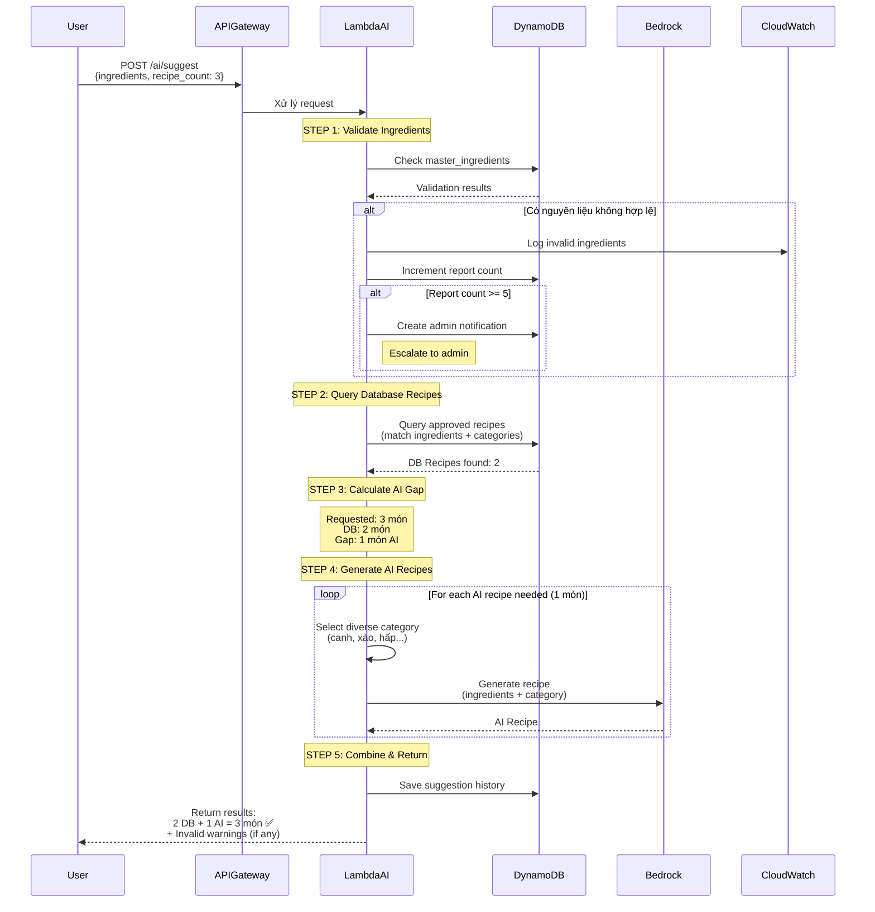

# UPDATED AI SUGGESTION FLOW - ENHANCED VERSION

## 🎯 Flow 1: AI Recipe Suggestion (Enhanced - Flexible Mix)

### Mermaid Diagram



---

## 📋 Detailed Flow Steps

### Step 1: Validate Ingredients với Reporting

```javascript
async function validateIngredientsWithReporting(ingredients, userId) {
  const results = {
    valid: [],
    invalid: [],
    warnings: []
  };

  for (const ing of ingredients) {
    // Check master ingredients
    const isValid = await checkMasterIngredients(ing);

    if (!isValid) {
      // Log to CloudWatch
      console.warn('Invalid ingredient detected', {
        ingredient: ing,
        user_id: userId,
        timestamp: new Date().toISOString()
      });

      // Increment report count
      const reportCount = await incrementInvalidIngredientReport(ing, userId);

      // Escalate if >= 5 reports
      if (reportCount >= 5) {
        await createAdminNotification({
          type: 'invalid_ingredient_spike',
          ingredient: ing,
          total_reports: reportCount,
          user_id: userId
        });
      }

      results.invalid.push(ing);
      results.warnings.push({
        ingredient: ing,
        message: `"${ing}" không có trong database. AI sẽ cố gắng xử lý.`,
        suggestions: await fuzzySearchIngredients(ing)
      });

    } else {
      results.valid.push(ing);
    }
  }

  return results;
}
```

---

### Step 2: Query Database với Category Diversity

```javascript
async function queryRecipesWithCategories(ingredients, requestedCount, userPreferences) {
  // Lấy user's preferred cooking methods
  const preferredMethods = userPreferences.preferred_cooking_methods || [];

  // Query DB recipes
  let dbRecipes = [];

  // Priority 1: User's preferred methods
  if (preferredMethods.length > 0) {
    for (const method of preferredMethods) {
      const recipes = await ddb.query({
        IndexName: 'GSI2',
        KeyConditionExpression: 'GSI2PK = :method',
        FilterExpression: 'is_approved = :approved',
        ExpressionAttributeValues: {
          ':method': `METHOD#${method}`,
          ':approved': true
        },
        Limit: 2  // Lấy 2 món mỗi method
      });

      dbRecipes.push(...recipes.Items);
    }
  }

  // Priority 2: Any approved recipes matching ingredients
  if (dbRecipes.length < requestedCount) {
    const moreRecipes = await queryByIngredients(
      ingredients,
      requestedCount - dbRecipes.length
    );
    dbRecipes.push(...moreRecipes);
  }

  // Limit to requested count
  dbRecipes = dbRecipes.slice(0, requestedCount);

  return dbRecipes;
}
```

---

### Step 3: Generate AI Recipes với Diverse Categories

```javascript
async function generateDiverseAIRecipes(ingredients, count, usedCategories = []) {
  const availableCategories = [
    { cooking_method: 'xào', meal_type: 'món chính' },
    { cooking_method: 'canh', meal_type: 'canh' },
    { cooking_method: 'hấp', meal_type: 'món phụ' },
    { cooking_method: 'trộn', meal_type: 'món phụ' },
    { cooking_method: 'kho', meal_type: 'món chính' },
    { cooking_method: 'chiên', meal_type: 'món chính' },
    { cooking_method: 'nướng', meal_type: 'món chính' },
    { cooking_method: 'luộc', meal_type: 'món phụ' }
  ];

  // Filter out already used categories
  const unusedCategories = availableCategories.filter(cat =>
    !usedCategories.some(used =>
      used.cooking_method === cat.cooking_method
    )
  );

  const aiRecipes = [];

  for (let i = 0; i < count; i++) {
    // Pick diverse category
    const category = unusedCategories[i % unusedCategories.length];

    // Generate AI recipe
    const prompt = `
Bạn là đầu bếp chuyên nghiệp Việt Nam.
Tạo công thức nấu ăn với:
- Nguyên liệu: ${ingredients.join(', ')}
- Phương pháp nấu: ${category.cooking_method}
- Loại món: ${category.meal_type}

Format JSON:
{
  "title": "Tên món ăn",
  "description": "Mô tả ngắn",
  "ingredients": [
    {"name": "...", "quantity": "...", "unit": "..."}
  ],
  "instructions": [
    "Bước 1: ...",
    "Bước 2: ..."
  ],
  "prep_time": 15,
  "cook_time": 30,
  "servings": 4
}
    `;

    const aiResponse = await bedrock.invoke({
      model: 'anthropic.claude-3-haiku-20240307-v1:0',
      prompt: prompt
    });

    const recipe = JSON.parse(aiResponse);
    recipe.cooking_method = category.cooking_method;
    recipe.meal_type = category.meal_type;
    recipe.is_ai_generated = true;

    aiRecipes.push(recipe);
  }

  return aiRecipes;
}
```

---

### Step 4: Flexible Mix Logic

```javascript
async function getFlexibleSuggestions(request, userId) {
  const {
    ingredients,
    recipe_count = 1  // Default 1 món
  } = request;

  // Validate count (1-5)
  const validatedCount = Math.max(1, Math.min(5, recipe_count));

  // Step 1: Validate ingredients
  const validation = await validateIngredientsWithReporting(ingredients, userId);

  // Nếu toàn invalid, return error
  if (validation.valid.length === 0) {
    return {
      statusCode: 400,
      body: {
        error: 'all_ingredients_invalid',
        message: 'Tất cả nguyên liệu không hợp lệ. Vui lòng nhập lại.',
        warnings: validation.warnings
      }
    };
  }

  // Step 2: Query DB recipes
  const userPreferences = await getUserPreferences(userId);
  const dbRecipes = await queryRecipesWithCategories(
    validation.valid,
    validatedCount,
    userPreferences
  );

  // Step 3: Calculate AI gap
  const aiGap = validatedCount - dbRecipes.length;

  // Step 4: Generate AI recipes if needed
  let aiRecipes = [];
  if (aiGap > 0) {
    const usedCategories = dbRecipes.map(r => ({
      cooking_method: r.cooking_method
    }));

    aiRecipes = await generateDiverseAIRecipes(
      validation.valid,
      aiGap,
      usedCategories
    );
  }

  // Step 5: Combine results
  const allRecipes = [...dbRecipes, ...aiRecipes];

  // Step 6: Save suggestion history
  await saveSuggestionHistory({
    user_id: userId,
    prompt_ingredients: ingredients,
    requested_count: validatedCount,
    recipes_from_db: dbRecipes.length,
    recipes_from_ai: aiRecipes.length,
    invalid_ingredients: validation.invalid,
    created_at: new Date().toISOString()
  });

  // Step 7: Return
  return {
    statusCode: 200,
    body: {
      recipes: allRecipes,
      stats: {
        requested: validatedCount,
        from_database: dbRecipes.length,
        from_ai: aiRecipes.length,
        total: allRecipes.length
      },
      warnings: validation.warnings.length > 0 ? validation.warnings : undefined
    }
  };
}
```

---

## 📊 Example Scenarios

### Scenario 1: DB đủ recipes
```
User request: 3 món
Ingredients: ["thịt gà", "cà chua", "hành"]

DB query result: 5 món match
→ Return: 3 DB + 0 AI ✅
→ Cost: Chỉ tốn DynamoDB read ($0.0001)
```

### Scenario 2: DB ít, cần AI
```
User request: 5 món
Ingredients: ["thịt gà", "cà chua"]

DB query result: 2 món match
→ Return: 2 DB + 3 AI ✅
→ Cost: DynamoDB + 3 Bedrock calls (~$0.015)
```

### Scenario 3: Invalid ingredients
```
User request: 3 món
Ingredients: ["thịt gà", "xyz123", "abc"]

Validation: 1 valid, 2 invalid
DB query: 0 món (1 ingredient không đủ)
→ Return: 0 DB + 3 AI + Warnings ⚠️
→ Log invalid ingredients
→ If report_count >= 5 → Notify admin
```

### Scenario 4: Diverse categories
```
User request: 5 món
Ingredients: ["thịt gà", "cà chua", "hành", "tỏi"]

DB: 2 món (xào, kho)
AI: 3 món (canh, hấp, trộn) ← Diverse!
→ Return: 1 bữa ăn cân bằng ✅
```

---

## ✅ Improvements vs Old Flow

| Aspect | Old Flow | New Flow | Benefit |
|--------|----------|----------|---------|
| Recipe count | Fixed 5 | Flexible 1-5 | User control |
| DB/AI mix | Fixed 4+1 | Dynamic | Cost saving |
| Invalid handling | Error | Warning + Report | Better UX |
| Category diversity | Random | Smart distribution | Balanced meal |
| Cost (DB đủ) | $0.02/request | $0.0001/request | **99% cheaper** |
| Cost (DB rỗng) | $0.02/request | $0.01-0.05/request | Flexible |
