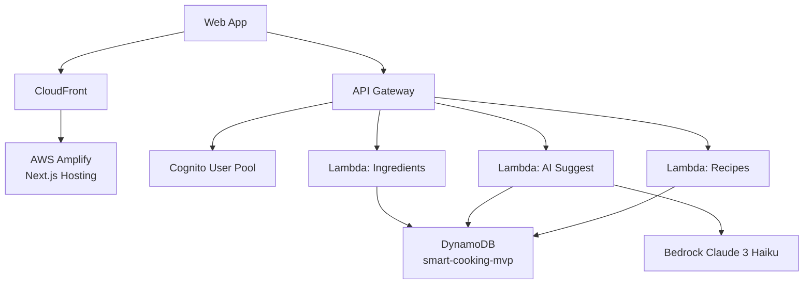

# AWS ARCHITECTURE - MVP SIMPLIFIED

## 🎯 Chỉ cần 4 Lambda Functions

### Lambda 1: Auth Handler
- **Trigger**: Cognito Post-Authentication
- **Memory**: 256MB
- **Purpose**: Tạo user profile khi đăng ký

### Lambda 2: User Ingredients Manager
- **Trigger**: API Gateway
- **Memory**: 256MB
- **Endpoints**:
  - `POST /user/ingredients` - Add ingredient
  - `GET /user/ingredients` - List ingredients
  - `DELETE /user/ingredients/{id}` - Remove ingredient

### Lambda 3: AI Suggestion Engine ⭐
- **Trigger**: API Gateway
- **Memory**: 1024MB
- **Endpoint**: `POST /ai/suggest`
- **Flow**:
  1. Get user's ingredients
  2. Call Bedrock (Claude 3 Haiku)
  3. Generate 3-5 recipes
  4. Save to ai_suggestions table
  5. Return results

### Lambda 4: Recipe Manager
- **Trigger**: API Gateway
- **Memory**: 256MB
- **Endpoints**:
  - `GET /recipes/{id}` - View recipe
  - `POST /recipes/{id}/favorite` - Toggle favorite
  - `GET /user/favorites` - List favorites

---

## 📊 AWS Services (Simplified)



---

## 🚫 LOẠI BỎ (So với bản full)

- ❌ Lambda: Posts & Comments (không cần)
- ❌ Lambda: Notifications (không cần)
- ❌ Lambda: Social/Friends (không cần)
- ❌ Lambda: Admin Operations (không cần)
- ❌ Lambda: Cooking History (quá phức tạp)
- ❌ Lambda: Rating & Approval (không cần)
- ❌ Lambda: Ingredient Validation (dùng simple validation)
- ❌ S3 (không có ảnh upload)
- ❌ WAF (không cần cho MVP)
- ❌ X-Ray (không cần cho MVP)

---

## 📋 API Endpoints (Simplified)

```
Authentication
POST   /auth/register
POST   /auth/login

User Management
GET    /user/profile
PUT    /user/profile

Ingredients
POST   /user/ingredients          # Add ingredient
GET    /user/ingredients          # List user's ingredients
DELETE /user/ingredients/{id}     # Remove ingredient

AI Suggestions
POST   /ai/suggest                # Get AI recipe suggestions
GET    /ai/history                # View past suggestions

Recipes
GET    /recipes/{id}              # View recipe detail
POST   /recipes/{id}/favorite     # Toggle favorite
GET    /user/favorites            # List favorite recipes
```

**Total**: 10 endpoints (thay vì 40+)

---

## 💰 Cost Comparison

| Service | Full Version | MVP Version | Savings |
|---------|--------------|-------------|---------|
| Lambda (8→4 functions) | $25 | $12 | -$13 |
| DynamoDB (13→1 table) | $40 | $12 | -$28 |
| API Gateway | $10 | $5 | -$5 |
| S3 | $10 | $0 | -$10 |
| WAF | $6 | $0 | -$6 |
| CloudWatch | $12 | $5 | -$7 |
| **TOTAL** | **$133** | **~$70** | **-$63** |

---

## ✅ Ưu điểm MVP

1. **Nhanh**: Deploy trong 2 tuần
2. **Rẻ**: Tiết kiệm 47% chi phí
3. **Đơn giản**: Dễ maintain, dễ demo
4. **Đủ tính năng**: Chứng minh được AI suggestion
5. **Dễ scale**: Có thể thêm features sau nếu cần
