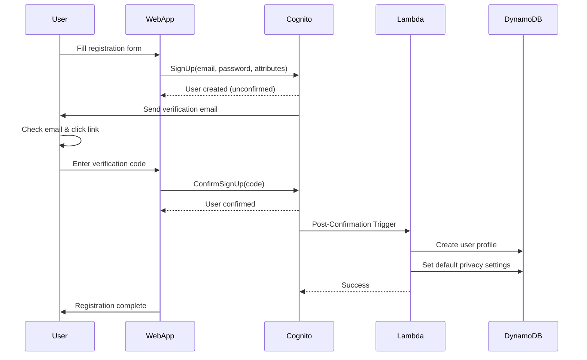
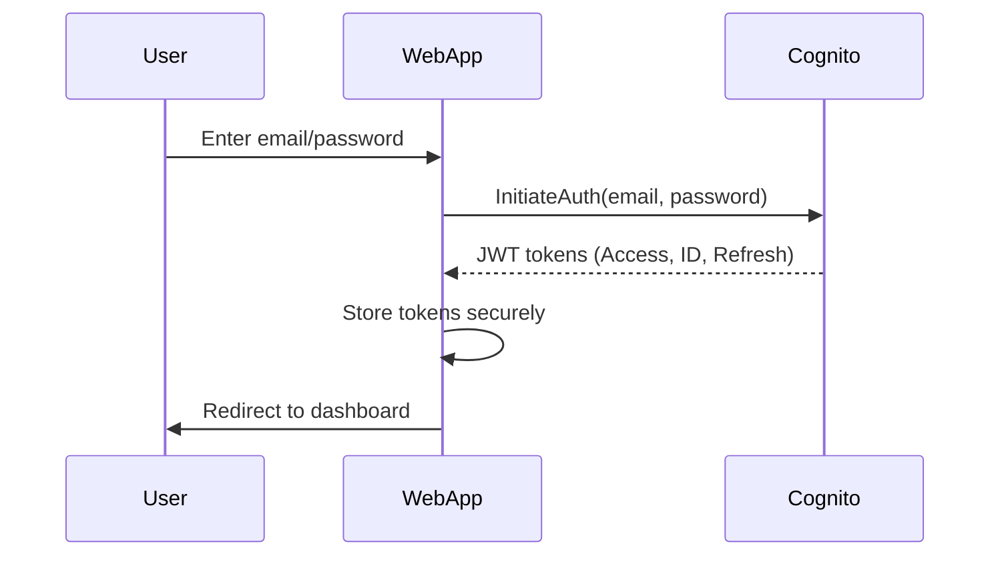
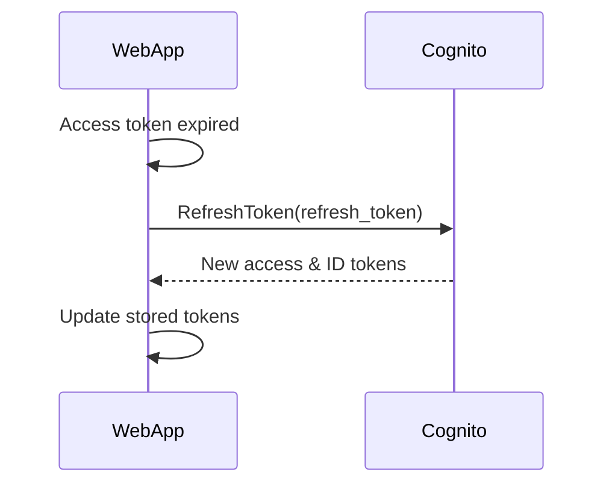

# Authentication & Authorization - Smart Cooking App

## Authentication Overview

### Authentication Strategy
- **Primary**: Amazon Cognito User Pool
- **Token Type**: JWT (JSON Web Tokens)
- **Session Management**: Access + Refresh tokens
- **MFA**: Optional (future enhancement)

### User Journey
```
Registration → Email Verification → Profile Setup → Dashboard Access
```

## 👤 Cognito User Pool Configuration

### User Pool Settings
```yaml
Pool Name: smart-cooking-users
Sign-in Options:
  - Email (primary)
  - Username (secondary)

Password Policy:
  Minimum Length: 8 characters
  Require:
    - Lowercase letters: Yes
    - Uppercase letters: Yes
    - Numbers: Yes
    - Special characters: Optional
  Temporary Password Expiry: 24 hours

Account Recovery:
  - Email verification code
  - No SMS (cost optimization)

Email Verification:
  Required: Yes
  Code Expiry: 24 hours
  From Email: noreply@smartcooking.app
```

### Custom Attributes
```yaml
Standard Attributes:
  - email (required, mutable)
  - name (required, mutable)
  - birthdate (optional, mutable)
  - gender (optional, mutable)

Custom Attributes:
  - custom:role (user|admin, immutable)
  - custom:username (unique identifier, mutable)
  - custom:country (Vietnam, US, etc., mutable)
  - custom:onboarding_completed (boolean, mutable)
```

### App Client Configuration
```yaml
App Client Name: smart-cooking-web-client
Auth Flows:
  - ALLOW_USER_PASSWORD_AUTH
  - ALLOW_REFRESH_TOKEN_AUTH
  - ALLOW_USER_SRP_AUTH

Token Validity:
  Access Token: 1 hour
  ID Token: 1 hour
  Refresh Token: 30 days

Read/Write Attributes:
  Read: email, name, birthdate, gender, custom:username, custom:country
  Write: name, birthdate, gender, custom:username, custom:country

OAuth 2.0 Settings:
  Callback URLs: 
    - https://smartcooking.app/auth/callback
    - http://localhost:3000/auth/callback (dev)
  Sign-out URLs:
    - https://smartcooking.app/
    - http://localhost:3000/ (dev)
```

## Authentication Flow

### Registration Flow


### Login Flow


### Token Refresh Flow


## JWT Token Structure

### Access Token Claims
```json
{
  "sub": "uuid-123-456-789",
  "cognito:username": "user@example.com",
  "email": "user@example.com",
  "email_verified": true,
  "iss": "https://cognito-idp.us-east-1.amazonaws.com/us-east-1_ABC123",
  "client_id": "abc123def456",
  "token_use": "access",
  "scope": "aws.cognito.signin.user.admin",
  "auth_time": 1706097600,
  "exp": 1706101200,
  "iat": 1706097600
}
```

### ID Token Claims
```json
{
  "sub": "uuid-123-456-789",
  "cognito:username": "user@example.com",
  "email": "user@example.com",
  "name": "John Doe",
  "birthdate": "1990-01-15",
  "gender": "male",
  "custom:role": "user",
  "custom:username": "johndoe",
  "custom:country": "Vietnam",
  "custom:onboarding_completed": "true",
  "iss": "https://cognito-idp.us-east-1.amazonaws.com/us-east-1_ABC123",
  "aud": "abc123def456",
  "token_use": "id",
  "auth_time": 1706097600,
  "exp": 1706101200,
  "iat": 1706097600
}
```

## Post-Confirmation Lambda

### Lambda Function: auth-handler
```javascript
exports.handler = async (event, context) => {
  console.log('Post-confirmation trigger:', JSON.stringify(event, null, 2));

  const { userAttributes, userName } = event.request;
  const userId = userAttributes.sub;

  try {
    // Create user profile in DynamoDB
    await createUserProfile(userId, userAttributes);
    
    // Set default privacy settings
    await createDefaultPrivacySettings(userId);
    
    // Log successful user creation
    console.log(`User profile created successfully for: ${userId}`);
    
    return event;
  } catch (error) {
    console.error('Error in post-confirmation:', error);
    throw error;
  }
};

async function createUserProfile(userId, attributes) {
  const userProfile = {
    PK: `USER#${userId}`,
    SK: 'PROFILE',
    entity_type: 'USER_PROFILE',
    user_id: userId,
    email: attributes.email,
    username: attributes['custom:username'] || attributes.email,
    full_name: attributes.name || '',
    date_of_birth: attributes.birthdate || null,
    gender: attributes.gender || null,
    country: attributes['custom:country'] || null,
    role: attributes['custom:role'] || 'user',
    is_active: true,
    created_at: new Date().toISOString(),
    updated_at: new Date().toISOString(),
    
    // GSI1 for role-based queries
    GSI1PK: `ROLE#${attributes['custom:role'] || 'user'}`,
    GSI1SK: `USER#${new Date().toISOString()}`
  };

  await ddb.put({
    TableName: process.env.DYNAMODB_TABLE,
    Item: userProfile
  });

  // Create default preferences
  const userPreferences = {
    PK: `USER#${userId}`,
    SK: 'PREFERENCES',
    entity_type: 'USER_PREFERENCES',
    dietary_restrictions: [],
    allergies: [],
    favorite_cuisines: [],
    preferred_cooking_methods: [],
    preferred_recipe_count: 1,
    spice_level: 'medium',
    created_at: new Date().toISOString(),
    updated_at: new Date().toISOString()
  };

  await ddb.put({
    TableName: process.env.DYNAMODB_TABLE,
    Item: userPreferences
  });
}

async function createDefaultPrivacySettings(userId) {
  const privacySettings = {
    PK: `USER#${userId}`,
    SK: 'PRIVACY',
    entity_type: 'PRIVACY_SETTINGS',
    profile_visibility: 'public',
    email_visibility: 'private',
    date_of_birth_visibility: 'friends',
    gender_visibility: 'public',
    country_visibility: 'public',
    recipes_visibility: 'public',
    ingredients_visibility: 'friends',
    preferences_visibility: 'friends',
    created_at: new Date().toISOString(),
    updated_at: new Date().toISOString()
  };

  await ddb.put({
    TableName: process.env.DYNAMODB_TABLE,
    Item: privacySettings
  });
}
```

## Authorization Implementation

### API Gateway Authorizer
```yaml
Authorizer Type: COGNITO_USER_POOLS
User Pool: smart-cooking-users
Token Source: Authorization header (Bearer token)
Token Validation:
  - Signature verification
  - Expiration check
  - Issuer validation
Authorization Caching: 300 seconds (5 minutes)

Identity Source: method.request.header.Authorization
```

### Lambda Authorization Context
```javascript
// Extract user context from Cognito authorizer
exports.handler = async (event, context) => {
  const claims = event.requestContext.authorizer.claims;
  
  const userContext = {
    userId: claims.sub,
    username: claims['cognito:username'],
    email: claims.email,
    role: claims['custom:role'] || 'user',
    country: claims['custom:country'],
    isActive: true // Additional check can be added
  };

  // Role-based authorization
  if (event.resource.includes('/admin/') && userContext.role !== 'admin') {
    return {
      statusCode: 403,
      body: JSON.stringify({
        error: 'forbidden',
        message: 'Admin access required'
      })
    };
  }

  // Resource ownership check
  const resourceUserId = event.pathParameters?.userId;
  if (resourceUserId && resourceUserId !== userContext.userId && userContext.role !== 'admin') {
    return {
      statusCode: 403,
      body: JSON.stringify({
        error: 'forbidden',
        message: 'You can only access your own resources'
      })
    };
  }

  // Continue with business logic
  return await processRequest(event, userContext);
};
```

### Role-Based Access Control (RBAC)
```javascript
const PERMISSIONS = {
  user: [
    'read:own_profile',
    'write:own_profile',
    'read:own_ingredients',
    'write:own_ingredients',
    'read:public_recipes',
    'write:own_recipes',
    'read:ai_suggestions',
    'write:ai_suggestions',
    'read:own_cooking_history',
    'write:own_cooking_history',
    'write:recipe_ratings',
    'read:friends',
    'write:friends',
    'read:own_posts',
    'write:own_posts',
    'write:comments',
    'write:reactions'
  ],
  admin: [
    '*', // All permissions
    'read:all_users',
    'write:user_status',
    'read:all_recipes',
    'write:recipe_approval',
    'read:statistics',
    'read:invalid_reports'
  ]
};

function hasPermission(role, permission) {
  const rolePermissions = PERMISSIONS[role] || [];
  return rolePermissions.includes('*') || rolePermissions.includes(permission);
}

function checkPermission(userRole, requiredPermission) {
  if (!hasPermission(userRole, requiredPermission)) {
    throw new Error(`Permission denied: ${requiredPermission} required`);
  }
}
```

## Frontend Authentication

### Auth Service (Client-Side)
```javascript
// src/public/js/auth.js
class AuthService {
  constructor() {
    this.user = null;
    this.isAuthenticated = false;
    this.checkAuthState();
  }

  async checkAuthState() {
    const token = this.getStoredToken();
    if (token && !this.isTokenExpired(token)) {
      this.user = this.parseTokenClaims(token);
      this.isAuthenticated = true;
    } else {
      this.clearAuth();
    }
  }

  async login(email, password) {
    try {
      const response = await fetch('/auth/login', {
        method: 'POST',
        headers: {
          'Content-Type': 'application/json'
        },
        body: JSON.stringify({ email, password })
      });

      if (!response.ok) {
        const error = await response.json();
        throw new Error(error.message || 'Login failed');
      }

      const data = await response.json();
      this.setAuth(data.access_token, data.user);
      
      return data;
    } catch (error) {
      throw error;
    }
  }

  async register(userData) {
    try {
      const response = await fetch('/auth/register', {
        method: 'POST',
        headers: {
          'Content-Type': 'application/json'
        },
        body: JSON.stringify(userData)
      });

      if (!response.ok) {
        const error = await response.json();
        throw new Error(error.message || 'Registration failed');
      }

      return await response.json();
    } catch (error) {
      throw error;
    }
  }

  async logout() {
    try {
      await fetch('/auth/logout', {
        method: 'POST',
        headers: {
          'Authorization': `Bearer ${this.getStoredToken()}`
        }
      });
    } catch (error) {
      console.error('Logout error:', error);
    } finally {
      this.clearAuth();
      window.location.href = '/';
    }
  }

  setAuth(token, user) {
    localStorage.setItem('access_token', token);
    this.user = user;
    this.isAuthenticated = true;
  }

  clearAuth() {
    localStorage.removeItem('access_token');
    this.user = null;
    this.isAuthenticated = false;
  }

  getStoredToken() {
    return localStorage.getItem('access_token');
  }

  isTokenExpired(token) {
    try {
      const payload = JSON.parse(atob(token.split('.')[1]));
      return payload.exp * 1000 < Date.now();
    } catch (error) {
      return true;
    }
  }

  parseTokenClaims(token) {
    try {
      const payload = JSON.parse(atob(token.split('.')[1]));
      return {
        userId: payload.sub,
        email: payload.email,
        username: payload['cognito:username'],
        role: payload['custom:role'] || 'user'
      };
    } catch (error) {
      return null;
    }
  }

  getAuthHeaders() {
    const token = this.getStoredToken();
    return token ? { 'Authorization': `Bearer ${token}` } : {};
  }
}

// Global auth service instance
const authService = new AuthService();
```

### Auth Middleware (Server-Side)
```javascript
// src/middleware/auth.js
const authService = require('../services/authService');

const requireAuth = (req, res, next) => {
  const token = req.headers.authorization?.replace('Bearer ', '') || req.cookies.accessToken;
  
  if (!token) {
    return res.redirect('/auth/login');
  }

  try {
    const user = authService.extractUserFromToken(token);
    req.user = user;
    res.locals.user = user;
    next();
  } catch (error) {
    res.clearCookie('accessToken');
    return res.redirect('/auth/login');
  }
};

const requireAdmin = (req, res, next) => {
  requireAuth(req, res, () => {
    if (req.user.role !== 'admin') {
      return res.status(403).render('error', {
        title: 'Access Denied',
        message: 'Admin privileges required'
      });
    }
    next();
  });
};

const optionalAuth = (req, res, next) => {
  const token = req.headers.authorization?.replace('Bearer ', '') || req.cookies.accessToken;
  
  if (token) {
    try {
      const user = authService.extractUserFromToken(token);
      req.user = user;
      res.locals.user = user;
    } catch (error) {
      res.clearCookie('accessToken');
    }
  }
  
  next();
};

module.exports = { requireAuth, requireAdmin, optionalAuth };
```

### API Client with Auth
```javascript
// src/services/apiClient.js
class ApiClient {
  constructor(baseURL) {
    this.baseURL = baseURL || process.env.API_URL;
  }

  async request(endpoint, options = {}) {
    const url = `${this.baseURL}${endpoint}`;
    const token = localStorage.getItem('access_token');
    
    const config = {
      headers: {
        'Content-Type': 'application/json',
        ...options.headers
      },
      ...options
    };

    if (token) {
      config.headers.Authorization = `Bearer ${token}`;
    }

    try {
      const response = await fetch(url, config);
      
      if (response.status === 401) {
        // Token expired, redirect to login
        localStorage.removeItem('access_token');
        window.location.href = '/auth/login';
        return;
      }

      if (!response.ok) {
        const error = await response.json();
        throw new Error(error.message || 'Request failed');
      }

      return await response.json();
    } catch (error) {
      throw error;
    }
  }

  async get(endpoint, options = {}) {
    return this.request(endpoint, { method: 'GET', ...options });
  }

  async post(endpoint, data, options = {}) {
    return this.request(endpoint, {
      method: 'POST',
      body: JSON.stringify(data),
      ...options
    });
  }

  async put(endpoint, data, options = {}) {
    return this.request(endpoint, {
      method: 'PUT',
      body: JSON.stringify(data),
      ...options
    });
  }

  async delete(endpoint, options = {}) {
    return this.request(endpoint, { method: 'DELETE', ...options });
  }
}

const apiClient = new ApiClient();
module.exports = apiClient;
```

## Security Best Practices

### Token Storage
```typescript
// Secure token storage (avoid localStorage for sensitive data)
class SecureTokenStorage {
  private static readonly ACCESS_TOKEN_KEY = 'access_token';
  private static readonly REFRESH_TOKEN_KEY = 'refresh_token';

  static setTokens(accessToken: string, refreshToken: string) {
    // Use httpOnly cookies in production
    if (typeof window !== 'undefined') {
      // For demo purposes - use secure cookies in production
      document.cookie = `${this.ACCESS_TOKEN_KEY}=${accessToken}; Secure; SameSite=Strict; Max-Age=3600`;
      document.cookie = `${this.REFRESH_TOKEN_KEY}=${refreshToken}; Secure; SameSite=Strict; Max-Age=2592000`;
    }
  }

  static clearTokens() {
    if (typeof window !== 'undefined') {
      document.cookie = `${this.ACCESS_TOKEN_KEY}=; expires=Thu, 01 Jan 1970 00:00:00 UTC; path=/;`;
      document.cookie = `${this.REFRESH_TOKEN_KEY}=; expires=Thu, 01 Jan 1970 00:00:00 UTC; path=/;`;
    }
  }
}
```

### Input Validation
```javascript
// Validation schemas for auth endpoints
const registrationSchema = {
  email: {
    type: 'string',
    format: 'email',
    required: true
  },
  password: {
    type: 'string',
    minLength: 8,
    pattern: '^(?=.*[a-z])(?=.*[A-Z])(?=.*\\d)',
    required: true
  },
  fullName: {
    type: 'string',
    minLength: 2,
    maxLength: 100,
    required: true
  },
  username: {
    type: 'string',
    minLength: 3,
    maxLength: 30,
    pattern: '^[a-zA-Z0-9_]+$',
    required: true
  }
};
```

## Related Documents

- [13 - Security](13-security.md)
- [41 - Privacy](41-privacy.md)
- [21 - Frontend](21-frontend.md)
- [20 - Backend](20-backend.md)