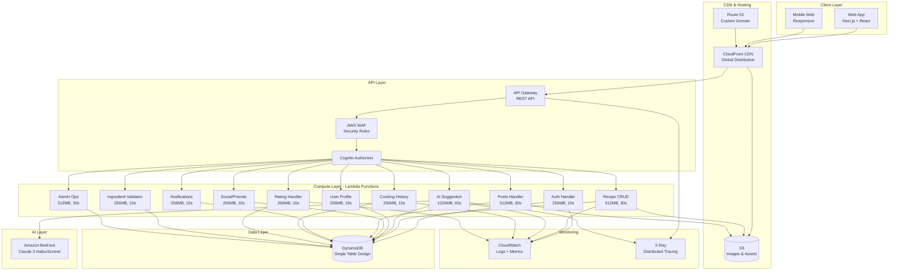
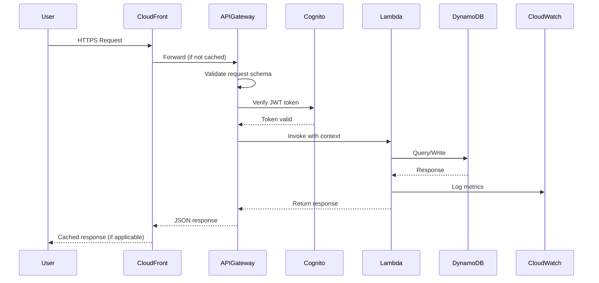
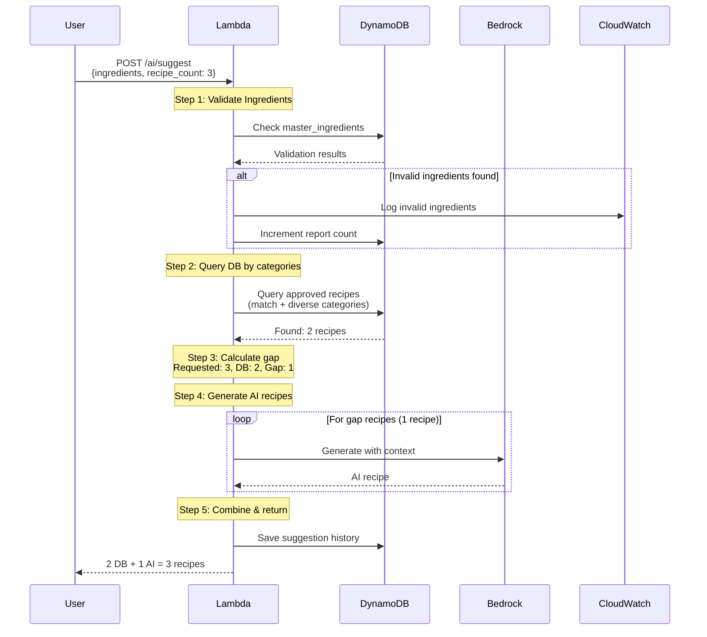
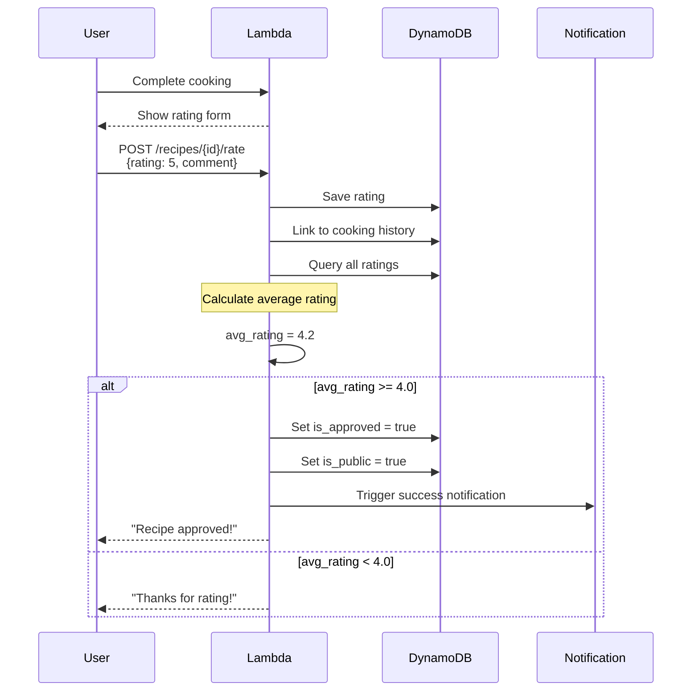
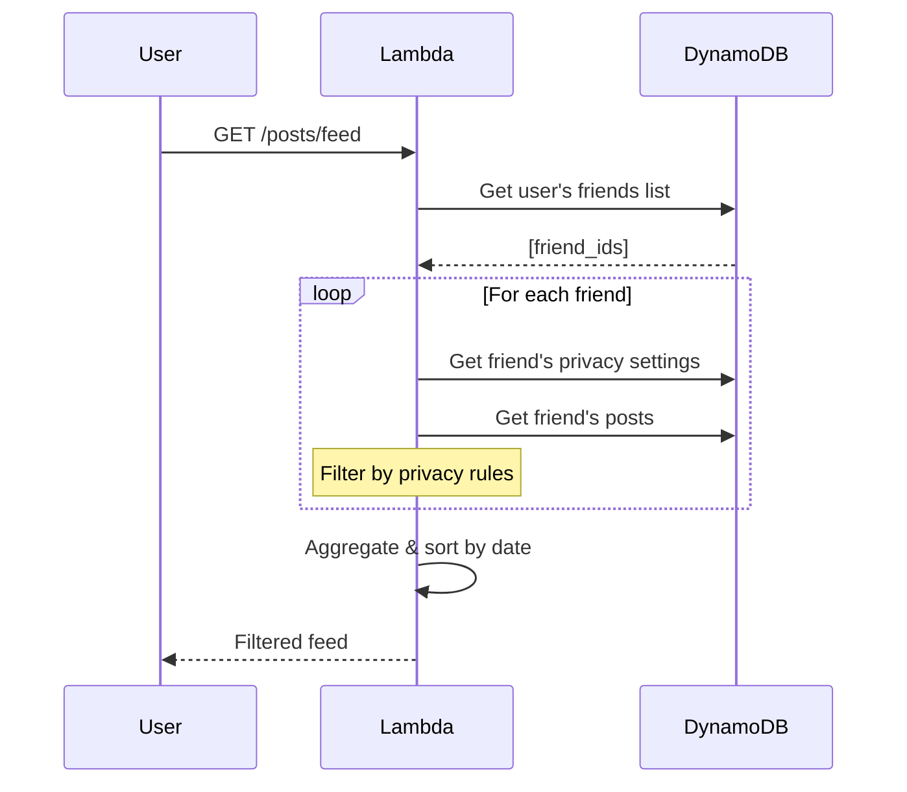
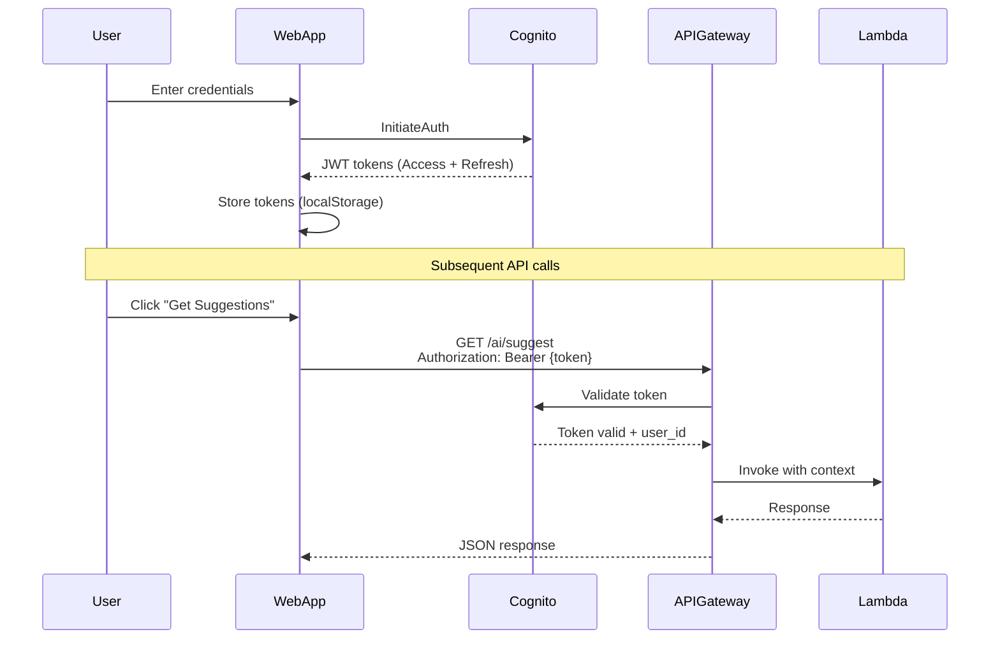
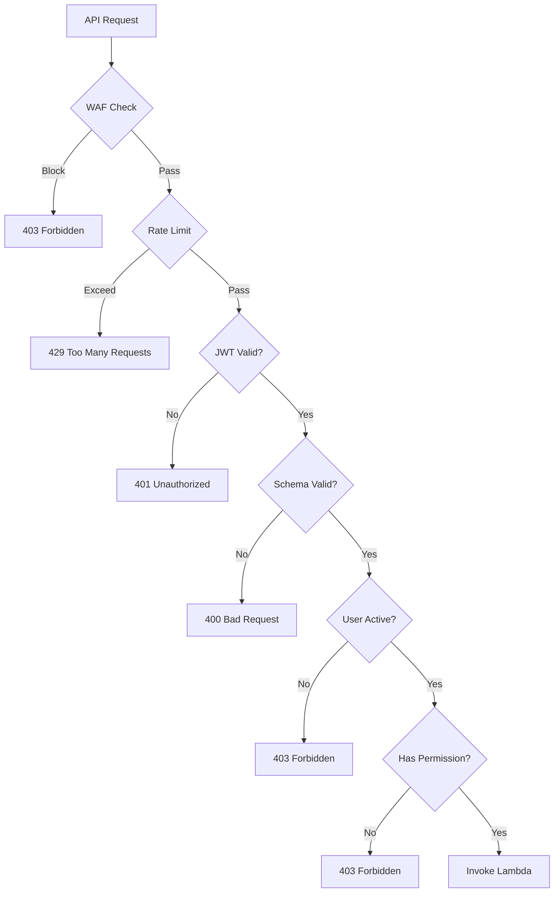

# Kiến Trúc Hệ Thống - Smart Cooking App

## Architecture Overview

### High-Level Architecture



## Architecture Principles

### 1. Serverless First
- **No server management**: Focus on code, not infrastructure
- **Auto-scaling**: Handle 10 to 10,000 users automatically
- **Pay-per-use**: Cost scales with usage
- **High availability**: Built-in redundancy

### 2. Single Responsibility
- Each Lambda function has ONE clear purpose
- Microservices architecture at function level
- Easy to test, debug, and maintain

### 3. Event-Driven
- Asynchronous processing where possible
- DynamoDB Streams trigger notifications
- Loose coupling between components

### 4. Security by Default
- All data encrypted at rest and in transit
- Least privilege IAM roles
- WAF protection on all endpoints
- JWT-based authentication

### 5. Cost-Optimized
- Flexible DB/AI mix to reduce AI costs
- CloudFront caching to reduce origin hits
- On-demand DynamoDB pricing
- Efficient Lambda memory allocation

## Architecture Patterns

### Pattern 1: API Request Flow



### Pattern 2: AI Suggestion Flow (Flexible Mix)



### Pattern 3: Auto-Approval Flow



### Pattern 4: Social Feed with Privacy



## Component Architecture

### Frontend Architecture (Node.js)

```
smart-cooking-webapp/
├── src/
│   ├── routes/
│   │   ├── index.js             # Landing page
│   │   ├── auth.js              # Auth routes (login, register, verify)
│   │   ├── dashboard.js         # Dashboard & ingredients
│   │   ├── recipes.js           # Recipe routes (detail, search, suggestions)
│   │   ├── cooking.js           # Cooking history & sessions
│   │   ├── social.js            # Social feed, friends, profiles
│   │   └── settings.js          # Profile & privacy settings
│   ├── views/
│   │   ├── layouts/
│   │   │   └── main.ejs         # Main layout template
│   │   ├── auth/
│   │   │   ├── login.ejs        # Login page
│   │   │   ├── register.ejs     # Registration
│   │   │   └── verify.ejs       # Email verification
│   │   ├── dashboard/
│   │   │   ├── index.ejs        # User dashboard
│   │   │   └── ingredients.ejs  # Manage ingredients
│   │   ├── recipes/
│   │   │   ├── detail.ejs       # Recipe detail
│   │   │   ├── search.ejs       # Recipe search
│   │   │   └── suggestions.ejs  # AI suggestions
│   │   ├── cooking/
│   │   │   ├── history.ejs      # Cooking history
│   │   │   └── session.ejs      # Cooking session
│   │   ├── social/
│   │   │   ├── feed.ejs         # Social feed
│   │   │   ├── friends.ejs      # Friends list
│   │   │   └── profile.ejs      # User profile
│   │   └── settings/
│   │       ├── profile.ejs      # Profile settings
│   │       └── privacy.ejs      # Privacy settings
│   ├── middleware/
│   │   ├── auth.js              # Authentication middleware
│   │   ├── validation.js        # Input validation
│   │   └── errorHandler.js      # Error handling
│   ├── services/
│   │   ├── apiClient.js         # API client
│   │   ├── authService.js       # Auth helpers
│   │   └── utils.js             # Utilities
│   └── public/
│       ├── css/
│       │   └── styles.css       # Global styles
│       ├── js/
│       │   ├── auth.js          # Auth frontend logic
│       │   ├── recipes.js       # Recipe frontend logic
│       │   └── ingredients.js   # Ingredients frontend logic
│       └── images/
├── app.js                       # Express app setup
├── server.js                    # Server entry point
└── package.json                 # Dependencies
```

### Backend Architecture (Lambda)

```
lambda-functions/
├── shared/
│   ├── dynamodb.js              # DynamoDB helpers
│   ├── auth.js                  # Auth utilities
│   ├── errors.js                # Error handlers
│   └── validation.js            # Input validation
├── auth-handler/
│   ├── index.js                 # Post-authentication
│   └── package.json
├── recipe-crud/
│   ├── index.js                 # Recipe CRUD
│   ├── s3-upload.js             # Image upload
│   └── package.json
├── ai-suggestion/
│   ├── index.js                 # Main handler
│   ├── bedrock-client.js        # Bedrock API
│   ├── ingredient-validator.js  # Validation
│   ├── recipe-query.js          # DB queries
│   └── package.json
├── user-profile/
│   ├── index.js                 # Profile CRUD
│   └── package.json
├── cooking-history/
│   ├── index.js                 # History CRUD
│   └── package.json
├── rating-handler/
│   ├── index.js                 # Rating + approval
│   ├── auto-approval.js         # Approval logic
│   └── package.json
├── social-friends/
│   ├── index.js                 # Friends CRUD
│   ├── privacy-filter.js        # Privacy logic
│   └── package.json
├── posts-handler/
│   ├── index.js                 # Posts CRUD
│   └── package.json
├── notifications/
│   ├── index.js                 # Notifications
│   └── package.json
├── ingredient-validator/
│   ├── index.js                 # Validation
│   ├── fuzzy-search.js          # Fuzzy matching
│   └── package.json
└── admin-ops/
    ├── index.js                 # Admin operations
    └── package.json
```

## Security Architecture

### Authentication Flow



### Authorization Layers



### IAM Roles Structure

```yaml
Roles:
  LambdaExecutionRole:
    Permissions:
      - logs:CreateLogGroup
      - logs:CreateLogStream
      - logs:PutLogEvents
      - xray:PutTraceSegments
      - xray:PutTelemetryRecords

  AISuggestionRole:
    Inherits: LambdaExecutionRole
    Additional:
      - dynamodb:Query
      - dynamodb:GetItem
      - dynamodb:PutItem
      - bedrock:InvokeModel

  RecipeCRUDRole:
    Inherits: LambdaExecutionRole
    Additional:
      - dynamodb:Query
      - dynamodb:GetItem
      - dynamodb:PutItem
      - dynamodb:UpdateItem
      - dynamodb:DeleteItem
      - s3:PutObject
      - s3:GetObject

  AdminRole:
    Inherits: RecipeCRUDRole
    Additional:
      - dynamodb:Scan
      - dynamodb:BatchWriteItem
      - cognito-idp:AdminDisableUser
```

## Data Architecture

### DynamoDB Single-Table Design

**Table Name**: `smart-cooking-data`

```
Access Patterns by Entity:

1. Users
   PK: USER#<user_id>
   SK: PROFILE | PREFERENCES | PRIVACY

2. Friendships
   PK: USER#<user_id>
   SK: FRIEND#<friend_id>
   GSI1: Reverse lookup

3. Ingredients
   PK: USER#<user_id>
   SK: INGREDIENT#<name>

   PK: INGREDIENT#<id>
   SK: METADATA
   GSI1PK: CATEGORY#<category>

4. Recipes
   PK: RECIPE#<recipe_id>
   SK: METADATA | INGREDIENT#<n>
   GSI1PK: USER#<user_id>
   GSI2PK: METHOD#<cooking_method> | CUISINE#<type>

5. Cooking History
   PK: USER#<user_id>
   SK: COOKING#<timestamp>#<id>
   GSI1PK: USER#<user_id>#FAVORITE

6. Ratings
   PK: RECIPE#<recipe_id>
   SK: RATING#<user_id>

7. AI Suggestions
   PK: USER#<user_id>
   SK: SUGGESTION#<timestamp>

8. Posts & Comments
   PK: POST#<post_id>
   SK: METADATA | COMMENT#<timestamp>
   GSI1PK: USER#<user_id>

9. Notifications
   PK: USER#<user_id>
   SK: NOTIFICATION#<timestamp>
   GSI1PK: USER#<user_id>#UNREAD
```

### Indexes Strategy

```
Primary Index:
  - PK: Partition Key
  - SK: Sort Key
  - Purpose: Main access pattern

GSI1 (User-Based Queries):
  - GSI1PK: Entity owner
  - GSI1SK: Timestamp or secondary sort
  - Purpose: User's data, reverse lookups

GSI2 (Discovery & Search):
  - GSI2PK: Category/Type
  - GSI2SK: Timestamp or rating
  - Purpose: Recipe search, browse by category

GSI3 (Social Feed):
  - GSI3PK: Feed type
  - GSI3SK: Timestamp
  - Purpose: Newsfeed, public posts
```

## Network Architecture

### VPC Configuration (Optional for MVP)
- **MVP**: No VPC (all services are public AWS services)
- **Future**: VPC for RDS if needed
- **Rationale**: Serverless services don't require VPC

### CDN Strategy

```
CloudFront Distribution:
  Origins:
    - S3: Static assets (images, CSS, JS) + Next.js build output
    - API Gateway: API endpoints

  Behaviors:
    /api/*:
      - TTL: 0 (no caching for API)
      - Forward headers: Authorization
    /assets/*:
      - TTL: 86400 (24 hours)
      - Compress: Yes
    /*:
      - TTL: 3600 (1 hour)
      - Compress: Yes

  Custom Domain: via Route 53
  Geo-Restrictions: None
  HTTPS: Required
  HTTP/2: Enabled
```

## Integration Architecture

### External Integrations (MVP)

1. **Amazon Cognito**
   - Purpose: User authentication
   - Integration: AWS SDK
   - Fallback: N/A (critical service)

2. **Amazon Bedrock**
   - Purpose: AI recipe generation
   - Integration: AWS SDK v3
   - Fallback: Return DB recipes only
   - Timeout: 60 seconds
   - Retry: 2 attempts with exponential backoff

3. **AWS Services (Internal)**
   - DynamoDB: Data persistence
   - S3: File storage
   - CloudWatch: Logging & monitoring
   - X-Ray: Distributed tracing

## Scalability Architecture

### Horizontal Scaling
- **Lambda**: Auto-scales to 1,000 concurrent (default)
- **DynamoDB**: On-demand mode (auto-scales)
- **S3**: Unlimited scaling
- **CloudFront**: Global edge network

### Vertical Scaling
- **Lambda Memory**: 256MB → 1024MB 
- **DynamoDB**: On-demand → Provisioned
- **Reserved Concurrency**: Add for critical functions

### Caching Strategy

```
Layer 1: CloudFront (Edge)
  - Static assets: 24 hours
  - Web pages: 1 hour

Layer 2: API Gateway (Optional)
  - Not used in MVP
  - Future: Cache GET requests

Layer 3: Lambda (In-Memory)
  - Master ingredients: Cache in Lambda
  - User context: Cache for request duration

Layer 4: DynamoDB
  - DAX (DynamoDB Accelerator): Post-MVP
  - Reduces read latency to microseconds
```

## Observability Architecture

### Logging Strategy

```
CloudWatch Log Groups:
  /aws/lambda/auth-handler
  /aws/lambda/recipe-crud
  /aws/lambda/ai-suggestion      # Most important
  /aws/lambda/cooking-history
  /aws/lambda/rating-handler
  /aws/lambda/*                  # Others
  /aws/apigateway/smart-cooking-api

Log Format (JSON):
  {
    "timestamp": "ISO 8601",
    "level": "INFO|WARN|ERROR",
    "request_id": "UUID",
    "user_id": "UUID",
    "function": "function_name",
    "message": "...",
    "metadata": {...}
  }

Retention: 7 days (cost optimization)
```

### Metrics & Alarms

```yaml
Critical Alarms:
  - Lambda errors > 1%
  - API Gateway 5xx > 10 requests/5min
  - DynamoDB throttled requests > 0
  - AI generation timeout > 10%
  - Monthly cost > $170

Warning Alarms:
  - Lambda duration > 5s (p95)
  - API latency > 500ms (p95)
  - Invalid ingredients > 10/hour
  - Monthly cost > $140

Metrics to Track:
  - API request count
  - Lambda invocations
  - DynamoDB read/write capacity
  - Bedrock API calls
  - S3 storage size
  - Cost per user
  - DB vs AI mix ratio
```

### Distributed Tracing

```
X-Ray Configuration:
  Services:
    - API Gateway (100% sampling)
    - Lambda AI Suggestion (100%)
    - Lambda Recipe CRUD (10% sampling)
    - DynamoDB (auto-instrumented)
    - Bedrock API (auto-instrumented)

  Trace Segments:
    1. API Gateway → Lambda
    2. Lambda → DynamoDB
    3. Lambda → Bedrock
    4. Lambda → S3

  Annotations:
    - user_id
    - recipe_count
    - db_recipes_count
    - ai_recipes_count
```

## Related Documents

- [00 - Overview](00-overview.md)
- [11 - Database](11-database.md)
- [12 - API Spec](12-api-spec.md)
- [13 - Security](13-security.md)
- [14 - AI Agent](14-ai-agent.md)
