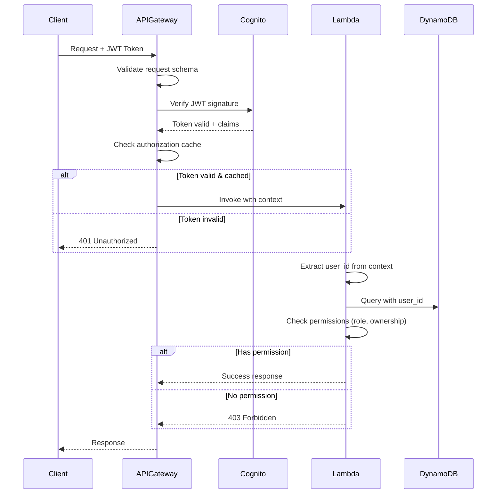

# Security Architecture - Smart Cooking App

##    Security Overview

### Security Principles

1. **Defense in Depth**: Multiple layers of security
2. **Least Privilege**: Minimum necessary permissions
3. **Zero Trust**: Verify everything, trust nothing
4. **Encryption Everywhere**: At rest and in transit
5. **Security by Default**: Secure configurations out of the box

### Compliance & Standards

```yaml
Standards:
  - OWASP Top 10 (Web Application Security)
  - AWS Well-Architected Framework (Security Pillar)
  - GDPR-Ready (EU data protection)

Certifications Target:
  - SOC 2 Type II (Post-MVP)
  - ISO 27001 (Future)
```

##    Authentication & Authorization

### 1. Amazon Cognito User Pool

#### Configuration
```yaml
User Pool Settings:
  Name: smart-cooking-users
  Sign-in Options:
    - Email
    - Username

  Password Policy:
    Minimum Length: 8 characters
    Require:
      - Lowercase letters
      - Uppercase letters
      - Numbers
      - Special characters (optional)
    Temporary Password: 24 hours expiry

  MFA (Multi-Factor Authentication):
    Status: Optional (MVP), Required (Premium - Future)
    Methods: SMS, TOTP

  Account Recovery:
    Methods: Email verification code

  Email Verification:
    Required: Yes
    Code Expiry: 24 hours

  User Attributes:
    Standard: email, name, birthdate, gender
    Custom:
      - country
      - preferred_cooking_methods
      - dietary_restrictions
```

#### JWT Token Structure

**Access Token** (1 hour expiry):
```json
{
  "sub": "uuid-123",
  "cognito:username": "cookmaster",
  "email": "user@example.com",
  "email_verified": true,
  "iss": "https://cognito-idp.us-east-1.amazonaws.com/...",
  "client_id": "abc123...",
  "token_use": "access",
  "scope": "aws.cognito.signin.user.admin",
  "auth_time": 1706097600,
  "exp": 1706101200,
  "iat": 1706097600
}
```

**ID Token** (1 hour expiry):
```json
{
  "sub": "uuid-123",
  "cognito:username": "cookmaster",
  "email": "user@example.com",
  "custom:role": "user",
  "custom:country": "Vietnam",
  "iss": "https://cognito-idp.us-east-1.amazonaws.com/...",
  "aud": "abc123...",
  "token_use": "id",
  "auth_time": 1706097600,
  "exp": 1706101200,
  "iat": 1706097600
}
```

**Refresh Token** (30 days expiry):
- Used to get new Access/ID tokens
- Stored securely in httpOnly cookie (not localStorage)
- Rotated on each use

### 2. API Gateway Authorization

#### Cognito Authorizer Configuration

```yaml
Authorizer Type: COGNITO_USER_POOLS
User Pool: smart-cooking-users
Token Source: Authorization header
Token Validation:
  - Signature verification
  - Expiration check
  - Issuer validation
Authorization Caching: 300 seconds (5 minutes)

Identity Source: method.request.header.Authorization

Unauthorized Response:
  Status: 401
  Body: { "message": "Unauthorized" }
```

#### Request Validation Flow



### 3. Lambda Authorization

#### Context Extraction

```javascript
// Lambda receives Cognito context from API Gateway
exports.handler = async (event, context) => {
  // Extract user identity from Cognito authorizer
  const claims = event.requestContext.authorizer.claims;

  const userId = claims.sub;
  const username = claims['cognito:username'];
  const email = claims.email;
  const role = claims['custom:role'] || 'user';

  // Authorization checks
  if (!isUserActive(userId)) {
    return {
      statusCode: 403,
      body: JSON.stringify({
        error: 'account_inactive',
        message: 'Your account has been deactivated'
      })
    };
  }

  // Resource ownership check
  if (requestedUserId !== userId && role !== 'admin') {
    return {
      statusCode: 403,
      body: JSON.stringify({
        error: 'forbidden',
        message: 'You do not have permission to access this resource'
      })
    };
  }

  // Proceed with business logic
  // ...
};
```

#### Role-Based Access Control (RBAC)

```javascript
const PERMISSIONS = {
  user: [
    'read:own_profile',
    'write:own_profile',
    'read:own_ingredients',
    'write:own_ingredients',
    'read:public_recipes',
    'write:own_recipes',
    'read:ai_suggestions',
    'write:ai_suggestions',
    'read:own_cooking_history',
    'write:own_cooking_history',
    'write:recipe_ratings',
    'read:friends',
    'write:friends',
    'read:own_posts',
    'write:own_posts',
    'write:comments',
    'write:reactions'
  ],
  admin: [
    '*', // All permissions
    'read:all_users',
    'write:user_status',
    'read:all_recipes',
    'write:recipe_approval',
    'read:statistics',
    'read:invalid_reports'
  ]
};

function hasPermission(role, permission) {
  const rolePermissions = PERMISSIONS[role] || [];
  return rolePermissions.includes('*') ||
         rolePermissions.includes(permission);
}
```

##    AWS WAF (Web Application Firewall)

### WAF Rules Configuration

```yaml
WAF WebACL: smart-cooking-waf
Scope: REGIONAL (API Gateway)
Default Action: ALLOW

Managed Rule Groups:
  - AWSManagedRulesCommonRuleSet:
      Priority: 1
      Excludes: []
      # Protects against:
      # - SQL injection
      # - XSS (Cross-Site Scripting)
      # - Path traversal
      # - Command injection

  - AWSManagedRulesKnownBadInputsRuleSet:
      Priority: 2
      # Blocks malicious request patterns

Custom Rules:
  - RateLimitRule:
      Priority: 10
      Type: RATE_BASED
      Limit: 1000 requests per 5 minutes per IP
      Action: BLOCK
      Scope: IP

  - GeoBlockRule:
      Priority: 20
      Type: GEO_MATCH
      Countries: [] # No blocking in MVP
      Action: BLOCK # Future: Block high-risk countries

  - APIEndpointProtection:
      Priority: 30
      Type: REGEX_PATTERN_SET
      Patterns:
        - /admin/* (Require admin token)
        - /ai/suggest (Rate limit: 100/hour/user)
      Action: CUSTOM_RESPONSE

Logging:
  Enabled: Yes
  Destination: CloudWatch Logs
  LogGroup: /aws/waf/smart-cooking
```

### Rate Limiting Strategy

```yaml
Tiers:
  Global:
    Requests: 1000 per 5 minutes per IP
    Action: Block for 10 minutes

  Free User:
    AI Suggestions: 10 per month
    API Requests: 1000 per hour
    Action: 429 Too Many Requests

  Premium User:
    AI Suggestions: Unlimited
    API Requests: 10000 per hour
    Action: 429 (soft limit, can burst)

  Admin:
    No limits
```

##    Data Encryption

### 1. Encryption at Rest

#### DynamoDB Encryption
```yaml
Encryption:
  Type: AWS Managed Keys (AWS KMS)
  Key: aws/dynamodb
  Algorithm: AES-256
  Scope: All tables and indexes

Point-in-Time Recovery (PITR):
  Enabled: Yes
  Encrypted: Yes (same key)
```

#### S3 Encryption
```yaml
Buckets:
  - smart-cooking-recipe-images-prod
  - smart-cooking-user-avatars-prod
  - smart-cooking-post-images-prod

Encryption:
  Type: SSE-S3 (Server-Side Encryption with S3 managed keys)
  Algorithm: AES-256

Bucket Policies:
  - Deny unencrypted uploads
  - Require HTTPS

Versioning: Enabled (critical buckets)
MFA Delete: Enabled (production)
```

#### CloudWatch Logs Encryption
```yaml
Encryption:
  Type: AWS KMS
  Key: aws/logs
  All log groups: Encrypted by default
```

### 2. Encryption in Transit

#### HTTPS Enforcement
```yaml
CloudFront:
  Protocol: HTTPS only
  TLS Version: 1.2 minimum (prefer 1.3)
  Ciphers: Strong ciphers only
    - TLS_AES_128_GCM_SHA256
    - TLS_AES_256_GCM_SHA384
    - TLS_CHACHA20_POLY1305_SHA256
  Certificate: AWS Certificate Manager (ACM)

API Gateway:
  Protocol: HTTPS only
  TLS Version: 1.2 minimum
  Certificate: ACM

S3 Pre-signed URLs:
  Protocol: HTTPS
  Expiry: 15 minutes
```

### 3. Secrets Management

#### AWS Secrets Manager
```yaml
Secrets Stored:
  - bedrock/api-key (if needed)
  - database/credentials (if using RDS - not in MVP)
  - third-party/api-keys (future)

Configuration:
  Rotation: Automatic (30 days)
  Encryption: AWS KMS
  Access: IAM roles only

Lambda Access:
  - Cache secrets in memory (Lambda lifecycle)
  - Refresh on rotation
```

#### Environment Variables
```javascript
// Lambda environment variables (encrypted)
process.env.DYNAMODB_TABLE = 'smart-cooking-data';
process.env.S3_BUCKET_RECIPES = 'smart-cooking-recipe-images-prod';
process.env.COGNITO_USER_POOL_ID = 'us-east-1_abc123';
process.env.BEDROCK_MODEL_ID = 'anthropic.claude-3-haiku-20240307-v1:0';

// Never store in code:
// ❌ API keys
// ❌ Database passwords
// ❌ Secret tokens
```

##    IAM (Identity and Access Management)

### Lambda Execution Roles

#### Base Lambda Role
```json
{
  "Version": "2012-10-17",
  "Statement": [
    {
      "Effect": "Allow",
      "Action": [
        "logs:CreateLogGroup",
        "logs:CreateLogStream",
        "logs:PutLogEvents"
      ],
      "Resource": "arn:aws:logs:*:*:*"
    },
    {
      "Effect": "Allow",
      "Action": [
        "xray:PutTraceSegments",
        "xray:PutTelemetryRecords"
      ],
      "Resource": "*"
    }
  ]
}
```

#### AI Suggestion Lambda Role
```json
{
  "Version": "2012-10-17",
  "Statement": [
    {
      "Effect": "Allow",
      "Action": [
        "dynamodb:GetItem",
        "dynamodb:Query",
        "dynamodb:PutItem"
      ],
      "Resource": [
        "arn:aws:dynamodb:us-east-1:*:table/smart-cooking-data",
        "arn:aws:dynamodb:us-east-1:*:table/smart-cooking-data/index/*"
      ]
    },
    {
      "Effect": "Allow",
      "Action": [
        "bedrock:InvokeModel"
      ],
      "Resource": "arn:aws:bedrock:us-east-1::foundation-model/anthropic.claude-3-haiku-*"
    }
  ]
}
```

#### Recipe CRUD Lambda Role
```json
{
  "Version": "2012-10-17",
  "Statement": [
    {
      "Effect": "Allow",
      "Action": [
        "dynamodb:GetItem",
        "dynamodb:Query",
        "dynamodb:PutItem",
        "dynamodb:UpdateItem",
        "dynamodb:DeleteItem"
      ],
      "Resource": "arn:aws:dynamodb:us-east-1:*:table/smart-cooking-data*"
    },
    {
      "Effect": "Allow",
      "Action": [
        "s3:PutObject",
        "s3:GetObject",
        "s3:DeleteObject"
      ],
      "Resource": "arn:aws:s3:::smart-cooking-*/*"
    }
  ]
}
```

### S3 Bucket Policies

#### Recipe Images Bucket
```json
{
  "Version": "2012-10-17",
  "Statement": [
    {
      "Sid": "DenyUnencryptedUploads",
      "Effect": "Deny",
      "Principal": "*",
      "Action": "s3:PutObject",
      "Resource": "arn:aws:s3:::smart-cooking-recipe-images-prod/*",
      "Condition": {
        "StringNotEquals": {
          "s3:x-amz-server-side-encryption": "AES256"
        }
      }
    },
    {
      "Sid": "RequireHTTPS",
      "Effect": "Deny",
      "Principal": "*",
      "Action": "*",
      "Resource": "arn:aws:s3:::smart-cooking-recipe-images-prod/*",
      "Condition": {
        "Bool": {
          "aws:SecureTransport": "false"
        }
      }
    },
    {
      "Sid": "AllowCloudFrontRead",
      "Effect": "Allow",
      "Principal": {
        "Service": "cloudfront.amazonaws.com"
      },
      "Action": "s3:GetObject",
      "Resource": "arn:aws:s3:::smart-cooking-recipe-images-prod/*"
    }
  ]
}
```

##    Security Monitoring & Incident Response

### CloudWatch Alarms

```yaml
Security Alarms:
  - UnauthorizedAPIAttempts:
      Metric: API Gateway 4xx errors
      Threshold: > 100 in 5 minutes
      Action: SNS notification

  - SuspiciousActivityDetected:
      Metric: WAF blocked requests
      Threshold: > 50 from same IP in 5 minutes
      Action: SNS + Lambda investigation

  - LambdaExecutionErrors:
      Metric: Lambda errors
      Threshold: > 10 in 5 minutes
      Action: SNS notification

  - UnusualDataAccess:
      Metric: DynamoDB throttled requests
      Threshold: > 0
      Action: SNS notification

  - CostAnomaly:
      Metric: Daily AWS cost
      Threshold: > $20/day (MVP)
      Action: SNS + Auto-disable non-critical functions
```

### AWS X-Ray Tracing

```yaml
Tracing:
  Services:
    - API Gateway (100% sampling)
    - Lambda AI Suggestion (100%)
    - Lambda Recipe CRUD (10% sampling)
    - DynamoDB (auto)
    - Bedrock (auto)

  Annotations:
    - user_id
    - request_id
    - api_endpoint
    - error_type

  Segments Tracked:
    - Authentication
    - Authorization
    - Database queries
    - AI API calls
    - S3 operations
```

### Logging Strategy

```yaml
CloudWatch Log Groups:
  /aws/lambda/*:
    Retention: 7 days
    Format: JSON
    Fields:
      - timestamp
      - level (INFO/WARN/ERROR)
      - request_id
      - user_id
      - function_name
      - message
      - metadata

  /aws/apigateway/smart-cooking-api:
    Retention: 7 days
    Format: CLF (Common Log Format)
    Include:
      - Request/Response bodies (excluding sensitive data)
      - Headers (excluding Authorization)
      - Status codes
      - Latency

  /aws/waf/smart-cooking:
    Retention: 30 days
    Include:
      - Blocked requests
      - Rate limit violations
      - Rule matches

Sensitive Data Filtering:
  - Password fields: Always masked
  - JWT tokens: Masked
  - Email addresses: Partially masked (u***@example.com)
  - Payment info: Never logged (future)
```

## 🔍 Vulnerability Management

### OWASP Top 10 Mitigations

#### 1. Injection (SQL, NoSQL, Command)
```yaml
Mitigations:
  - DynamoDB: Parameterized queries (SDK handles)
  - Input validation: API Gateway + Lambda
  - WAF: SQL injection rule set
  - Code review: No eval(), no dynamic queries
```

#### 2. Broken Authentication
```yaml
Mitigations:
  - Cognito User Pool: Industry-standard auth
  - JWT tokens: Short-lived (1 hour)
  - Refresh tokens: Secure httpOnly cookies
  - MFA: Optional (premium feature)
  - Password policy: Strong requirements
```

#### 3. Sensitive Data Exposure
```yaml
Mitigations:
  - HTTPS: Everywhere
  - Encryption at rest: All data (DynamoDB, S3)
  - Secrets Manager: API keys
  - No sensitive data in logs
  - Privacy settings: User control
```

#### 4. XML External Entities (XXE)
```yaml
Mitigations:
  - Not applicable: JSON-only API
```

#### 5. Broken Access Control
```yaml
Mitigations:
  - JWT validation: Every request
  - Resource ownership: Checked in Lambda
  - RBAC: user/admin roles
  - Privacy filtering: Applied before response
  - API Gateway: Method-level authorization
```

#### 6. Security Misconfiguration
```yaml
Mitigations:
  - Infrastructure as Code: Consistent config
  - AWS Config: Compliance monitoring
  - Security Group: Least privilege
  - S3 Buckets: Private by default
  - Error messages: No stack traces in production
```

#### 7. Cross-Site Scripting (XSS)
```yaml
Mitigations:
  - API: JSON only (not HTML)
  - Frontend: React auto-escapes
  - CSP headers: Content Security Policy
  - Input validation: Sanitize user content
  - WAF: XSS rule set
```

#### 8. Insecure Deserialization
```yaml
Mitigations:
  - JSON parsing: Safe (JSON.parse)
  - No user-controlled deserialization
  - Input validation: Schema validation
```

#### 9. Using Components with Known Vulnerabilities
```yaml
Mitigations:
  - Dependabot: Automated vulnerability scanning
  - npm audit: Regular checks
  - AWS managed services: Auto-patched
  - Lambda runtime: Latest Node.js 20 LTS
```

#### 10. Insufficient Logging & Monitoring
```yaml
Mitigations:
  - CloudWatch: Comprehensive logging
  - X-Ray: Distributed tracing
  - Alarms: Real-time alerts
  - Retention: 7-30 days
  - Centralized: All logs in CloudWatch
```

##    API Security Best Practices

### Request Validation

```javascript
// API Gateway Request Validator
const requestSchema = {
  type: 'object',
  required: ['ingredients', 'recipe_count'],
  properties: {
    ingredients: {
      type: 'array',
      minItems: 2,
      maxItems: 20,
      items: {
        type: 'string',
        minLength: 1,
        maxLength: 100
      }
    },
    recipe_count: {
      type: 'integer',
      minimum: 1,
      maximum: 5
    }
  }
};

// Lambda validation
function validateInput(body) {
  // Sanitize strings
  const sanitized = body.ingredients.map(ing =>
    ing.trim().replace(/[<>]/g, '')
  );

  // Validate count based on user tier
  if (userTier === 'free' && body.recipe_count > 1) {
    throw new Error('Free tier limited to 1 recipe');
  }

  return sanitized;
}
```

### CORS Configuration

```yaml
API Gateway CORS:
  Access-Control-Allow-Origin:
    - https://smartcooking.app
    - http://localhost:3000 (development)
  Access-Control-Allow-Methods:
    - GET, POST, PUT, DELETE, OPTIONS
  Access-Control-Allow-Headers:
    - Content-Type
    - Authorization
    - X-Request-ID
  Access-Control-Max-Age: 3600
  Access-Control-Allow-Credentials: true
```

### Security Headers

```javascript
// Lambda response headers
const securityHeaders = {
  'Strict-Transport-Security': 'max-age=31536000; includeSubDomains',
  'X-Content-Type-Options': 'nosniff',
  'X-Frame-Options': 'DENY',
  'X-XSS-Protection': '1; mode=block',
  'Content-Security-Policy': "default-src 'self'; img-src 'self' https://s3.amazonaws.com; script-src 'self'",
  'Referrer-Policy': 'strict-origin-when-cross-origin',
  'Permissions-Policy': 'geolocation=(), microphone=(), camera=()'
};
```

##    Privacy & Data Protection

### GDPR Compliance

```yaml
Data Subject Rights:
  1. Right to Access:
      Endpoint: GET /user/data-export
      Format: JSON
      Includes: Profile, recipes, history, posts

  2. Right to Deletion:
      Endpoint: DELETE /user/account
      Process:
        - Delete user data from DynamoDB
        - Delete S3 objects
        - Anonymize logs (keep for 7 days)
        - Delete Cognito user

  3. Right to Rectification:
      Endpoint: PUT /user/profile
      User can update any personal data

  4. Right to Portability:
      Endpoint: GET /user/data-export
      Format: JSON (machine-readable)

  5. Right to Object:
      Endpoint: PUT /user/privacy
      User can restrict data usage

  6. Right to be Informed:
      Privacy Policy: Clear explanation
      Consent: Explicit opt-in
      Notifications: Data breach within 72 hours

Data Minimization:
  - Collect only necessary data
  - AI uses: age range (not exact birthdate)
  - Location: Country only (not city/address)
  - No tracking pixels (MVP)

Data Retention:
  - User data: Until account deletion
  - Logs: 7-30 days
  - Backups: 35 days (PITR)
  - AI suggestions: 90 days (optional)
```

### AI Privacy Policy

```markdown
## AI Agent Data Usage

The Smart Cooking AI uses the following data to personalize recipe suggestions:

**Data Used:**
- Age range (derived from birth year) - for nutritional recommendations
- Gender - for portion size recommendations
- Country - for regional cuisine preferences
- Cooking preferences (stir-fry, steam, soup, etc.)
- Favorite cuisines (Vietnamese, Italian, etc.)
- Allergies - **CRITICAL** for food safety

**Data NOT Used:**
- Full name
- Email address
- Exact location
- Payment information
- Browsing history

**Purpose:**
- Personalize recipe suggestions only
- No advertising or marketing
- No third-party sharing
- No profiling beyond cooking preferences

**User Control:**
- You can update preferences anytime
- You can delete your data anytime
- AI suggestions are optional
```

##    Related Documents

- [10 - Architecture](10-architecture.md)
- [12 - API Spec](12-api-spec.md)
- [14 - AI Agent](14-ai-agent.md)
- [41 - Privacy](41-privacy.md)
