# AI Agent Design - Smart Cooking App

##    AI Agent Overview

### Vision
Tạo AI agent thông minh có khả năng:
- **Hiểu ngữ cảnh**: Personalize dựa trên user profile
- **Linh hoạt**: Mix DB và AI recipes để tối ưu cost
- **Đa dạng**: Gợi ý các phương pháp nấu khác nhau
- **An toàn**: Tuyệt đối tránh allergies
- **Học hỏi**: Tự động cải thiện qua community ratings

### Core Technologies
```yaml
AI Provider: Amazon Bedrock
Model: Claude 3 Haiku (cost-effective) or Sonnet (quality)
Input Limit: 200K tokens
Output Limit: 8K tokens recommended
Timeout: 60 seconds
Fallback: DB recipes only if AI fails
```

##    AI Agent Features

### 1. Flexible DB/AI Mix Strategy ⭐

#### Concept
```
User Request: "Gợi ý 3 món với gà, cà chua, hành"

System Process:
  Step 1: Validate ingredients với master_ingredients
  Step 2: Query DB cho approved recipes (match + diverse categories)
  Step 3: Calculate gap = requested_count - db_count
  Step 4: Generate gap recipes bằng AI
  Step 5: Return combined results

Example Output:
  - 2 món từ DB (xào, canh) ← Tiết kiệm cost
  - 1 món từ AI (hấp) ← Đa dạng phương pháp
```

#### Flow Diagram

```mermaid
sequenceDiagram
    participant User
    participant Lambda
    participant DynamoDB
    participant Bedrock

    User->>Lambda: POST /ai/suggest<br/>{ingredients, recipe_count: 3}

    Note over Lambda: STEP 1: Validate
    Lambda->>DynamoDB: Check master_ingredients
    DynamoDB-->>Lambda: All valid ✅

    Note over Lambda: STEP 2: Query DB
    Lambda->>DynamoDB: Query approved recipes<br/>WHERE match ingredients<br/>AND diverse categories
    DynamoDB-->>Lambda: Found 2 recipes:<br/>- Gà xào cà chua (stir-fry)<br/>- Canh cà chua (soup)

    Note over Lambda: STEP 3: Calculate Gap<br/>Requested: 3<br/>DB: 2<br/>Gap: 1

    Note over Lambda: STEP 4: Generate AI
    Lambda->>Bedrock: Generate 1 recipe<br/>(diverse: steam/bake/grill)
    Bedrock-->>Lambda: AI Recipe:<br/>- Gà hấp cà chua (steam)

    Note over Lambda: STEP 5: Combine
    Lambda->>DynamoDB: Save suggestion history
    Lambda-->>User: Return 3 recipes:<br/>2 DB + 1 AI
```



#### Cost Optimization

```yaml
Scenarios:

  Case 1: DB Coverage High (80%)
    Request: 5 recipes
    DB Found: 4 recipes
    AI Generate: 1 recipe
    Cost: 1 AI call (~$0.002)
    Savings: 80% vs pure AI

  Case 2: DB Coverage Medium (60%)
    Request: 5 recipes
    DB Found: 3 recipes
    AI Generate: 2 recipes
    Cost: 2 AI calls (~$0.004)
    Savings: 60% vs pure AI

  Case 3: DB Coverage Low (20%)
    Request: 5 recipes
    DB Found: 1 recipe
    AI Generate: 4 recipes
    Cost: 4 AI calls (~$0.008)
    Savings: 20% vs pure AI

  Case 4: Cold Start (0%)
    Request: 5 recipes
    DB Found: 0 recipes
    AI Generate: 5 recipes
    Cost: 5 AI calls (~$0.010)
    Savings: 0% (but builds DB!)

Strategy:
  - Start: 0% DB, 100% AI
  - Month 3: 30% DB, 70% AI
  - Month 6: 60% DB, 40% AI
  - Month 12: 80% DB, 20% AI

  Total Cost Reduction: 0% → 80% over 1 year
```

### 2. Category-Based Diversity ⭐

#### Problem
User nhận 5 món giống nhau (tất cả xào) → Không diverse

#### Solution
```javascript
// Query DB với category diversity
async function queryDiverseRecipes(ingredients, count) {
  const categories = ['stir-fry', 'soup', 'steam', 'grill', 'bake'];
  const results = [];

  // Try to get 1 recipe per category
  for (const method of categories) {
    if (results.length >= count) break;

    const recipe = await ddb.query({
      IndexName: 'GSI2',
      KeyConditionExpression: 'GSI2PK = :pk',
      FilterExpression: 'contains(ingredients_list, :ing)',
      ExpressionAttributeValues: {
        ':pk': `METHOD#${method}`,
        ':ing': ingredients[0] // Main ingredient
      },
      Limit: 1
    });

    if (recipe.Items.length > 0) {
      results.push(recipe.Items[0]);
    }
  }

  return results;
}
```

#### AI Prompt for Diversity
```
Generate a recipe with these requirements:
- Cooking method: {method} (must be different from DB recipes)
- Ensure diversity in meal preparation
```

### 3. Invalid Ingredient Handling ⭐

#### Flow


#### Implementation

```javascript
async function validateIngredientsWithReporting(ingredients, userId) {
  const validated = [];
  const invalid = [];
  const warnings = [];

  for (const ing of ingredients) {
    const normalized = normalizeText(ing);

    // Check exact match
    const exactMatch = await ddb.query({
      TableName: 'smart-cooking-data',
      IndexName: 'GSI2',
      KeyConditionExpression: 'GSI2PK = :pk AND GSI2SK = :sk',
      ExpressionAttributeValues: {
        ':pk': 'INGREDIENT#SEARCH',
        ':sk': `NAME#${normalized}`
      }
    });

    if (exactMatch.Items.length > 0) {
      validated.push(exactMatch.Items[0].name);
      continue;
    }

    // Fuzzy search
    const similar = await fuzzySearchIngredients(normalized);

    if (similar.length > 0 && similar[0].confidence >= 0.8) {
      // Auto-correct
      validated.push(similar[0].name);
      warnings.push({
        original: ing,
        corrected: similar[0].name,
        confidence: similar[0].confidence
      });
    } else {
      // Invalid - log and report
      invalid.push(ing);

      // Log to CloudWatch
      console.log(JSON.stringify({
        level: 'WARN',
        event: 'invalid_ingredient',
        user_id: userId,
        ingredient: ing,
        normalized: normalized,
        suggestions: similar.slice(0, 5)
      }));

      // Increment report count
      await incrementInvalidReport(normalized, userId);

      warnings.push({
        ingredient: ing,
        message: 'Nguyên liệu không hợp lệ',
        suggestions: similar.slice(0, 5).map(s => s.name),
        reported: true
      });
    }
  }

  return { validated, invalid, warnings };
}

async function incrementInvalidReport(normalized, userId) {
  // Check if already reported by this user
  const existing = await ddb.get({
    TableName: 'smart-cooking-data',
    Key: {
      PK: `INVALID_INGREDIENT#${normalized}`,
      SK: `USER#${userId}`
    }
  });

  if (existing.Item) {
    // Increment user report count
    await ddb.update({
      TableName: 'smart-cooking-data',
      Key: {
        PK: `INVALID_INGREDIENT#${normalized}`,
        SK: `USER#${userId}`
      },
      UpdateExpression: 'ADD user_report_count :inc',
      ExpressionAttributeValues: { ':inc': 1 }
    });
  } else {
    // Create new report
    await ddb.put({
      TableName: 'smart-cooking-data',
      Item: {
        PK: `INVALID_INGREDIENT#${normalized}`,
        SK: `USER#${userId}`,
        ingredient_name: normalized,
        user_report_count: 1,
        total_reports: 1,
        status: 'pending',
        created_at: new Date().toISOString(),

        GSI1PK: 'REPORTS#PENDING',
        GSI1SK: `TOTAL#1#${new Date().toISOString()}`
      }
    });
  }

  // Check if should notify admin (>= 5 reports)
  const totalReports = await getTotalReports(normalized);
  if (totalReports >= 5) {
    await notifyAdmin('invalid_ingredient_threshold', {
      ingredient: normalized,
      total_reports: totalReports
    });
  }
}
```

##    AI Prompt Engineering

### Base Prompt Template

```javascript
function buildAIPrompt(ingredients, userContext, diverseCategory) {
  const age = userContext.birth_year
    ? new Date().getFullYear() - userContext.birth_year
    : null;

  return `You are a professional chef. Create a creative recipe based on:

**Available Ingredients:**
${ingredients.map(ing => `- ${ing}`).join('\n')}

**User Context (for personalization):**
${age ? `- Age: ${age} years (adjust nutrition)` : ''}
${userContext.gender ? `- Gender: ${userContext.gender} (adjust portion size)` : ''}
${userContext.country ? `- Country: ${userContext.country} (prefer local cuisine)` : ''}

**Cooking Preferences:**
${userContext.preferred_cooking_methods?.length > 0
  ? `- Preferred methods: ${userContext.preferred_cooking_methods.join(', ')}`
  : '- No specific preference'}

**Favorite Cuisines:**
${userContext.cuisine_preference?.length > 0
  ? `- Preferred cuisines: ${userContext.cuisine_preference.join(', ')}`
  : '- No preference'}

**Allergies (ABSOLUTELY AVOID):**
${userContext.allergies?.length > 0
  ? userContext.allergies.map(a => `- ❌ ${a} (NEVER USE)`).join('\n')
  : '- No allergies'}

**Requirements:**
1. Use MOST or ALL of the provided ingredients
2. Cooking method: **${diverseCategory}** (IMPORTANT: Must use this method)
3. If country is ${userContext.country}, prefer local cuisine style
4. If favorite cuisine is ${userContext.cuisine_preference?.join('/')}, use that style
5. **ABSOLUTELY NEVER** use allergy ingredients: ${userContext.allergies?.join(', ') || 'None'}
6. Suitable for ${age ? `${age} years old` : 'adults'}
7. Creative and unique recipe (not in database)
8. Nutritionally balanced

**Return JSON format:**
{
  "name": "Recipe name in ${userContext.country || 'local'} language",
  "cuisine_type": "${userContext.cuisine_preference?.[0] || 'Vietnamese'}",
  "cooking_method": "${diverseCategory}",
  "meal_type": "main/side/soup/dessert",
  "difficulty": "easy/medium/hard",
  "cooking_time": "30 minutes",
  "servings": 2,
  "ingredients": [
    {
      "ingredient_name": "Ingredient name",
      "quantity": "100g",
      "preparation": "Chop into pieces"
    }
  ],
  "instructions": [
    {
      "step_number": 1,
      "description": "Step description",
      "duration": "5 minutes"
    }
  ],
  "nutritional_info": {
    "calories": 300,
    "protein": "20g",
    "carbs": "30g",
    "fat": "10g"
  },
  "tags": ["healthy", "quick", "family-friendly"],
  "notes": "Suitable for ${age ? `${age} years old` : 'adults'}. ${userContext.allergies?.length > 0 ? 'Allergy-safe.' : ''}"
}`;
}
```

### Privacy-Aware Prompt

```javascript
// Privacy metadata (logged but NOT sent to AI)
const privacyMetadata = {
  age_range: age ? `${Math.floor(age / 10) * 10}-${Math.floor(age / 10) * 10 + 9}` : null,
  gender: userContext.gender || null,
  country: userContext.country || null,
  cuisine_preference: userContext.cuisine_preference || [],
  allergies_avoided: userContext.allergies || [],

  // NOT included:
  email: undefined,
  full_name: undefined,
  exact_birthdate: undefined,
  address: undefined
};

// Saved to DynamoDB for audit
await ddb.put({
  TableName: 'smart-cooking-data',
  Item: {
    PK: `USER#${userId}`,
    SK: `AI_SUGGESTION#${timestamp}`,
    personalization_used: privacyMetadata,
    prompt_hash: hashPrompt(prompt), // For debugging
    created_at: new Date().toISOString()
  }
});
```

##    AI Response Processing

### Parse & Validate

```javascript
async function processAIResponse(aiResponse, ingredients, userContext) {
  let recipe;

  try {
    // Parse JSON from AI
    const responseBody = JSON.parse(aiResponse.body);
    const recipeText = responseBody.content[0].text;
    recipe = JSON.parse(recipeText);
  } catch (error) {
    console.error('AI response parsing error:', error);
    throw new Error('Failed to parse AI recipe');
  }

  // Validate required fields
  const requiredFields = [
    'name', 'cuisine_type', 'cooking_method',
    'ingredients', 'instructions'
  ];

  for (const field of requiredFields) {
    if (!recipe[field]) {
      throw new Error(`Missing required field: ${field}`);
    }
  }

  // Validate NO allergies
  if (userContext.allergies?.length > 0) {
    const recipeIngredients = recipe.ingredients.map(
      ing => normalizeText(ing.ingredient_name)
    );

    const allergyFound = userContext.allergies.some(allergy => {
      const normalized = normalizeText(allergy);
      return recipeIngredients.some(ing => ing.includes(normalized));
    });

    if (allergyFound) {
      console.error('AI generated recipe with allergy ingredient!');
      throw new Error('Recipe contains allergy ingredients');
    }
  }

  // Add metadata
  recipe.recipe_id = `ai-gen-${generateUUID()}`;
  recipe.source = 'ai';
  recipe.is_new = true;
  recipe.is_approved = false;
  recipe.is_ai_generated = true;
  recipe.created_by = 'bedrock-ai';
  recipe.created_at = new Date().toISOString();
  recipe.personalization_used = {
    age_range: userContext.age_range,
    gender: userContext.gender,
    country: userContext.country,
    allergies_avoided: userContext.allergies
  };

  return recipe;
}
```

### Error Handling & Fallback

```javascript
async function generateAIRecipesWithFallback(
  ingredients,
  userContext,
  count,
  usedMethods
) {
  const recipes = [];
  const availableMethods = [
    'stir-fry', 'soup', 'steam', 'grill', 'bake', 'fry', 'boil'
  ].filter(m => !usedMethods.includes(m));

  for (let i = 0; i < count; i++) {
    const method = availableMethods[i % availableMethods.length];

    try {
      const recipe = await callBedrockAI(ingredients, userContext, method);
      recipes.push(recipe);
    } catch (error) {
      console.error(`AI generation failed for ${method}:`, error);

      // Fallback: Try DB again
      const fallbackRecipe = await queryRecipeByMethod(method, ingredients);

      if (fallbackRecipe) {
        recipes.push(fallbackRecipe);
      } else {
        // Ultimate fallback: Return generic recipe template
        recipes.push(createGenericRecipe(ingredients, method));
      }
    }
  }

  return recipes;
}

function createGenericRecipe(ingredients, method) {
  return {
    recipe_id: `generic-${generateUUID()}`,
    name: `${ingredients[0]} ${method}`,
    source: 'fallback',
    cooking_method: method,
    ingredients: ingredients.map(ing => ({
      ingredient_name: ing,
      quantity: 'To taste'
    })),
    instructions: [
      {
        step_number: 1,
        description: `Prepare ${ingredients.join(', ')} using ${method} method`,
        duration: '30 minutes'
      }
    ],
    note: 'Generic recipe - AI unavailable. Please customize.'
  };
}
```

##    AI Performance Metrics

### Tracking

```javascript
// Save AI suggestion with metrics
await ddb.put({
  TableName: 'smart-cooking-data',
  Item: {
    PK: `USER#${userId}`,
    SK: `SUGGESTION#${new Date().toISOString()}`,
    suggestion_id: generateUUID(),
    ingredients_used: ingredients,
    requested_recipe_count: count,
    recipes_from_db: dbRecipes.length,
    recipes_from_ai: aiRecipes.length,
    invalid_ingredients: invalidIngredients,

    // Performance metrics
    db_query_time_ms: dbQueryTime,
    ai_generation_time_ms: aiGenerationTime,
    total_time_ms: totalTime,

    // Cost tracking
    ai_input_tokens: inputTokens,
    ai_output_tokens: outputTokens,
    estimated_cost_usd: (inputTokens * 0.00025 + outputTokens * 0.00125) / 1000,

    created_at: new Date().toISOString(),

    // For analytics
    GSI1PK: 'ANALYTICS#AI_USAGE',
    GSI1SK: `DATE#${new Date().toISOString().split('T')[0]}`
  }
});
```

### Analytics Dashboard (Admin)

```javascript
async function getAIAnalytics(startDate, endDate) {
  const suggestions = await ddb.query({
    TableName: 'smart-cooking-data',
    IndexName: 'GSI1',
    KeyConditionExpression: 'GSI1PK = :pk AND GSI1SK BETWEEN :start AND :end',
    ExpressionAttributeValues: {
      ':pk': 'ANALYTICS#AI_USAGE',
      ':start': `DATE#${startDate}`,
      ':end': `DATE#${endDate}`
    }
  });

  const stats = {
    total_suggestions: suggestions.Items.length,
    total_recipes_generated: suggestions.Items.reduce(
      (sum, item) => sum + item.recipes_from_ai, 0
    ),
    total_recipes_from_db: suggestions.Items.reduce(
      (sum, item) => sum + item.recipes_from_db, 0
    ),
    db_coverage_ratio: 0,
    avg_generation_time_ms: 0,
    total_cost_usd: suggestions.Items.reduce(
      (sum, item) => sum + (item.estimated_cost_usd || 0), 0
    ),
    invalid_ingredients_count: suggestions.Items.reduce(
      (sum, item) => sum + (item.invalid_ingredients?.length || 0), 0
    )
  };

  const totalRecipes = stats.total_recipes_generated + stats.total_recipes_from_db;
  stats.db_coverage_ratio = totalRecipes > 0
    ? (stats.total_recipes_from_db / totalRecipes * 100).toFixed(1) + '%'
    : '0%';

  stats.avg_generation_time_ms = Math.round(
    suggestions.Items.reduce(
      (sum, item) => sum + (item.ai_generation_time_ms || 0), 0
    ) / suggestions.Items.length
  );

  return stats;
}
```

## 🎓 AI Learning & Improvement

### Auto-Approval Feedback Loop


### Continuous Improvement

```javascript
// After recipe approval, analyze for quality
async function analyzeApprovedRecipe(recipeId) {
  const recipe = await getRecipe(recipeId);
  const ratings = await getRecipeRatings(recipeId);

  const analysis = {
    recipe_id: recipeId,
    average_rating: recipe.average_rating,
    rating_count: recipe.rating_count,
    was_ai_generated: recipe.is_ai_generated,
    cooking_method: recipe.cooking_method,
    cuisine_type: recipe.cuisine_type,

    // User feedback analysis
    positive_keywords: extractKeywords(
      ratings.filter(r => r.rating >= 4).map(r => r.comment)
    ),
    negative_keywords: extractKeywords(
      ratings.filter(r => r.rating < 4).map(r => r.comment)
    ),

    // Success factors
    success_factors: []
  };

  // Identify what worked
  if (recipe.average_rating >= 4.5) {
    analysis.success_factors.push('high_quality');
  }
  if (recipe.cooking_time_minutes <= 30) {
    analysis.success_factors.push('quick_recipe');
  }
  if (recipe.difficulty === 'easy') {
    analysis.success_factors.push('easy_to_make');
  }

  // Save for future prompt optimization
  await ddb.put({
    TableName: 'smart-cooking-data',
    Item: {
      PK: 'ANALYTICS#RECIPE_SUCCESS',
      SK: `RATING#${recipe.average_rating}#${recipeId}`,
      ...analysis,
      created_at: new Date().toISOString()
    }
  });

  return analysis;
}
```

##    Related Documents

- [10 - Architecture](10-architecture.md)
- [11 - Database](11-database.md)
- [12 - API Spec](12-api-spec.md)
- [20 - Backend](20-backend.md)
- [30 - Cost Analysis](30-cost-analysis.md)
