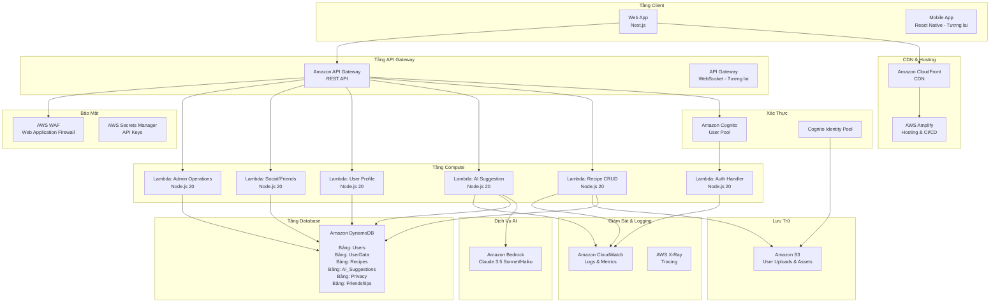
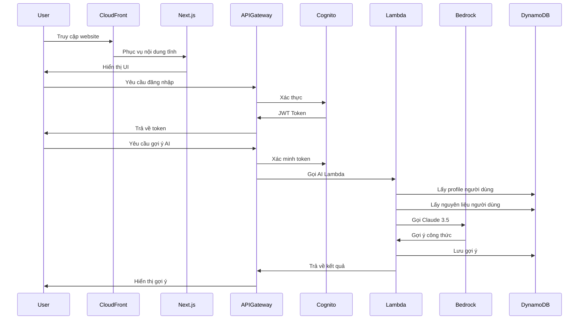

# Sơ Đồ Kiến Trúc Dịch Vụ AWS

## Kiến Trúc Hệ Thống



## Phân Tích Chi Tiết Các Dịch Vụ

### 1. Frontend & CDN

**AWS Amplify:**
- Host ứng dụng Next.js
- Pipeline CI/CD (tự động deploy từ GitHub)
- Custom domain & SSL certificates
- Chi phí: ~$15/tháng

**Amazon CloudFront:**
- CDN toàn cầu cho phân phối nội dung nhanh chóng
- Cache các static assets
- Chi phí: ~$5-10/tháng (1TB data transfer)

### 2. Xác Thực & Phân Quyền

**Amazon Cognito User Pool:**
- Đăng ký & đăng nhập người dùng
- Xác minh email
- Khôi phục mật khẩu
- Hỗ trợ MFA (tương lai)
- Chi phí: MIỄN PHÍ (< 50,000 )

**Cognito Identity Pool:**
- Thông tin xác thực AWS tạm thời để truy cập S3
- Quyền IAM chi tiết

### 3. Tầng API

**Amazon API Gateway (REST):**
- RESTful API endpoints
- Validation request
- Quản lý API key
- Throttling & rate limiting
- Cấu hình CORS
- Chi phí: ~$3.50 trên triệu requests

#### API Endpoints

```
POST   /auth/register
POST   /auth/login
GET    /user/profile
PUT    /user/profile
POST   /user/ingredients
GET    /user/ingredients
DELETE /user/ingredients/{id}
PUT    /user/privacy
GET    /user/privacy

POST   /friends/request
GET    /friends
PUT    /friends/{id}/accept
PUT    /friends/{id}/reject
DELETE /friends/{id}

POST   /recipes
GET    /recipes/{id}
PUT    /recipes/{id}
DELETE /recipes/{id}
GET    /recipes/search

POST   /ai/suggest
GET    /ai/suggestions
POST   /ai/feedback
```

### 4. Lambda Functions

#### Lambda 1: Auth Handler
- Runtime: Node.js 20
- Memory: 256MB
- Timeout: 10s
- Triggers: Cognito Post-Authentication
- Mục đích: Tạo profile người dùng khi đăng nhập lần đầu

#### Lambda 2: Recipe CRUD
- Runtime: Node.js 20
- Memory: 512MB
- Timeout: 30s
- Triggers: API Gateway
- Mục đích:
  - Tạo, đọc, cập nhật, xóa recipes
  - Upload ảnh recipe lên S3
  - Query DynamoDB

#### Lambda 3: AI Suggestion Engine ⭐
- Runtime: Node.js 20
- Memory: 1024MB
- Timeout: 60s
- Triggers: API Gateway
- Mục đích:
  - Gọi Amazon Bedrock (Claude 3.5)
  - Tạo gợi ý công thức
  - Phân tích nguyên liệu người dùng
  - Lưu gợi ý vào DynamoDB
- Chi phí: Lambda tốn kém nhất (~70% chi phí compute)

#### Lambda 4: User Profile Manager
- Runtime: Node.js 20
- Memory: 256MB
- Timeout: 10s
- Triggers: API Gateway
- Mục đích:
  - Quản lý profile & preferences người dùng
  - Cập nhật danh sách nguyên liệu
  - Xử lý upload avatar
  - Quản lý cài đặt riêng tư

#### Lambda 5: Social/Friends Handler
- Runtime: Node.js 20
- Memory: 256MB
- Timeout: 10s
- Triggers: API Gateway
- Mục đích:
  - Quản lý yêu cầu kết bạn
  - Chấp nhận/từ chối yêu cầu kết bạn
  - Liệt kê danh sách bạn bè
  - Lọc dữ liệu theo privacy settings

#### Lambda 6: Admin Operations
- Runtime: Node.js 20
- Memory: 512MB
- Timeout: 30s
- Triggers: API Gateway (Chỉ Admin)
- Mục đích:
  - Quản lý người dùng (ban/unban)
  - Kiểm duyệt nội dung
  - Thống kê hệ thống
  - Phê duyệt/từ chối recipes

### 5. Dịch Vụ AI/ML

#### Amazon Bedrock (Claude 3.5)
- Model: Claude 3.5 Sonnet (hoặc Haiku để tiết kiệm chi phí)
- Use Case: AI agent gợi ý công thức
- Input: Profile người dùng + preferences + nguyên liệu
- Output: Gợi ý công thức với hướng dẫn
- Chi phí:
  - Sonnet: $3 trên triệu input tokens, $15 trên triệu output tokens
  - Haiku: $0.25 trên triệu input tokens, $1.25 trên triệu output tokens
  - Ước tính: $25-50/tháng (1,000 users, 10 suggestions/user/tháng)
  - Với Haiku: $3-7/tháng (tiết kiệm 70%)

### 6. Database

#### Amazon DynamoDB (NoSQL Database)
Các bảng:
- **Users** (PK: user_id) - Tài khoản người dùng & roles
- **UserData** (PK: user_id, SK: data_type) - Preferences, nguyên liệu
- **PrivacySettings** (PK: user_id) - Cấu hình riêng tư
- **Friendships** (PK: user_id, SK: friend_id) - Kết nối mạng xã hội
- **Recipes** (PK: recipe_id, GSI: user_id) - Dữ liệu công thức
- **AISuggestions** (PK: user_id, SK: timestamp) - Lịch sử AI

Tính năng:
- Auto-scaling (on-demand mode)
- Point-in-time recovery (PITR)
- DynamoDB Streams (cho cập nhật real-time)
- Global Secondary Indexes (GSI) cho truy vấn
- Mã hóa at rest
- Chi phí: $15-25/tháng (on-demand pricing)

**Tại sao chọn DynamoDB thay vì RDS?**
- ✅ Serverless (không cần quản lý server)
- ✅ Auto-scaling về zero cost khi idle
- ✅ Tích hợp tốt hơn với Lambda
- ✅ Độ trễ thấp hơn cho key-value access
- ✅ Tiết kiệm chi phí cho MVP ($15 vs $30+ cho RDS)

### 7. Lưu Trữ

#### Amazon S3
Buckets:
- `recipe-images-prod`: Ảnh công thức
- `user-avatars-prod`: Ảnh đại diện
- `static-assets-prod`: Assets ứng dụng

Tính năng:
- Versioning enabled
- Lifecycle policies (xóa sau 90 ngày cho temp files)
- S3 Transfer Acceleration
- Chi phí: ~$5/tháng (50GB storage)

### 8. Bảo Mật

#### AWS WAF
Bảo vệ:
- SQL injection
- XSS attacks
- Rate limiting (1000 requests/5min mỗi IP)
- Geographic restrictions (tùy chọn)
- Chi phí: $5/tháng + $1 trên triệu requests

#### AWS Secrets Manager
Secrets:
- Database credentials (nếu dùng RDS)
- Third-party API keys (nếu cần)
- Chi phí: $0.40 mỗi secret mỗi tháng

### 9. Giám Sát & Logging

#### Amazon CloudWatch
- Logs: Tất cả logs của Lambda functions
- Metrics: Metrics của API Gateway, Lambda, DynamoDB
- Alarms:
  - Lambda errors > 1%
  - API Gateway 5xx errors
  - DynamoDB throttling
- Chi phí: ~$5-10/tháng

#### AWS X-Ray
- Tracing: Tracing request từ đầu đến cuối
- Performance: Xác định bottlenecks
- Chi phí: $5 trên triệu traces (100k đầu miễn phí)

## Sơ Đồ Luồng Dữ Liệu


